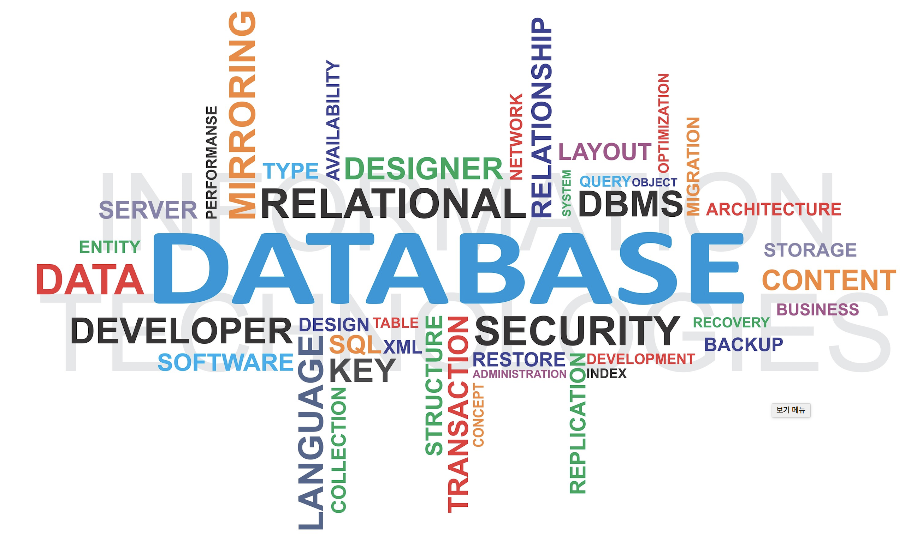
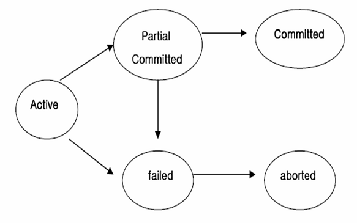
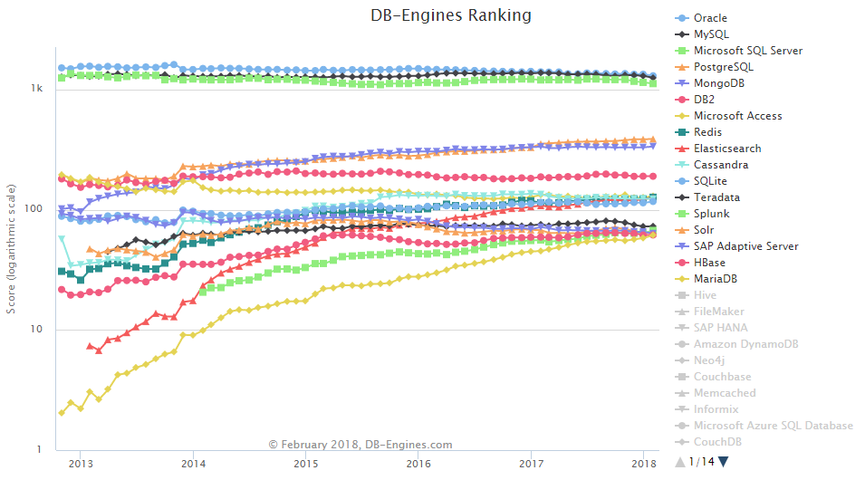

# Database

- 대량의 데이터를 구조적으로 관리하는 기술
- 여러 사람이 공유하고 사용할 목적으로 통합하여 관리되는 관련있는 데이터들의 구조화된 집합
- 데이터들은 미리 정의된 명확한 기준과 구조에 맞추어 동일한 형식으로 저장됨 
- 동일한 내용의 데이터가 중복되어 있지 않아야 하고, 다양한 접근 방식이 마련되어 있어야 하며, 검색이나 갱신, 조인이 효율적으로 이루어질 수 있도록 해야 한다.

## 왜 Database를 이용하는가?

- 익숙한 파일 시스템을 사용해서 데이터를 관리할 수도 있음. 

- 하지만 동시 공유가 가능하지 않기 때문에 프로그램마다 자료가 중복될 수 있어 저장 공간이 낭비되고, 데이터 무결성이 보장되지 않고, 생산성이 떨어지며, 데이터가 응용 프로그램에 의존하게 됨

- 데이터베이스는 자기기술성을 가져 DBMS를 통해 데이터의 삽입 및 삭제를 데이터/구조적 종속 없이 수행할 수 있고, 저장 구조 등을 수정하는 것이 응용 프로그램에 영향을 미치지 않는다. 즉 프로그램과 데이터가 다른 차원으로 격리된다. 

- DBMS는 복잡한 데이터베이스의 구조에 대한 정보를 감추고, 각 사용자에게 인터페이스 뷰를 제공한다. 

- 다수의 사용자에게 동시 접근을 허용한다. 이를 '동시성 제어'라고 한다.

  

## DBMS(Database Management System)

- 데이터들의 모임인 데이터베이스를 관리하고 데이터를 읽거나 쓰게 처리해주는 시스템
- 플랫폼이자 소프트웨어의 모음
- 흔히 DB = DBMS로 통용됨  
- 관계형, 키-값형, 객체형, 문서형, 컬럼형 등으로 세분
- 

## CRUD

- **Create(생성), Read(읽기), Update(수정), Delete(삭제)**

- 기술적인 측면에서 데이터베이스 작업의 최소 단위

- DBMS의 핵심적 기능, 데이터 컨트롤의 기본

  

## Transaction(트랜잭션)

- 업무적인 측면에서 데이터베이스 작업의 최소 단위

- 연관된 여러 개의 CRUD 단위 작업들을 단일한 실행 단위로 묶어주는 기능 = LUW(logical Units of Work, 논리적 작업 단위)

- 커밋(Commit)과 롤백(Rollback)을 통해 완전한 성공 또는 완전한 실패를 보장하여 완결성을 보장한다

  

## ACID

- 트랜잭션의 4대 원칙

  #### (1) Atomically(원자성)

  하나의 트랜잭션 내에 정의된 작업들은 모두 수행되든지, 아니면 아무 것도 수행되지 않아야 한다 

  트랜잭션이 제대로 실행되지 않았으면 롤백(roll-back)한다

  #### (2) Consistency(일관성)

  성공적으로 수행된 트랜잭션은 정당한 데이터만을 반영해 데이터베이스에서 정한 무결성(integrity) 조건을 만족해야 한다

  트랜잭션의 전후에서 일관성 있는 데이터 상태를 유지해야 한다

  #### (3) Isolation(격리성)

  각각의 트랜잭션은 독립성을 지녀야 하며, 하나의 트랜잭션이 실행되는 동안의 데이터에 다른 트랜잭션이 접근할 수 없다

  두 개의 트랜잭션은 서로에게 영향을 미칠 수 없다. 고립성 원칙

  #### (4) Durability(지속성) 

  트랜잭션이 성공적으로 이루어진 후에는 (하드웨어, 소프트웨어 오류가 발생하더라도) 트랜잭션의 결과가 데이터베이스에 계속 보존되어야 한다

이외에도 DBMS는

- 중복 제어 : 동일한 데이터가 여러 위치에 중복 저장되는 현상을 방지

- 접근 통제 : DBMS는 사용자마다 다양한 권한을 부여할 수 있으며, 권한에 따라 데이터에 대한 접근을 제어할 수 있음
- 인터페이스 제공 : DBMS는 사용자에게 SQL 및 CLI, GUI 등 다양한 인터페이스를 제공한다.
- 관계 표현 : 서로 다른 데이터간의 다양한 관계를 표현할 수 있는 기능을 제공한다.
  - 샤딩/파티셔닝 : 구조 최적화를 위해 작은 단위로 쪼개는 기능을 제공한다.
- 무결성 제약 조건 
- 백업/회복 

등의 기능을 지원한다

## DBMS의 종류

#### (1) 관계형(Relational)

- 데이터를 **칼럼(Column)**과 **로우(Row)**를 이루는 **<u>테이블</u>** 형식으로 처리하는 데이터베이스
- 같은 속성 항목(관계)을 가진 데이터들을 묶어 테이블로 구분해서 저장해 놓은 것
- 테이블은 복수의 칼럼(Column)으로 구성되며, 각 칼럼은 데이터를 하위 속성으로 나누어 저장함. (Skima)
- 테이블은 칼럼이 가질 수 있는 값에 규칙이나 범위를 설정할 수 있으며, 이를 **제약(Constraint)**이라 하고 칼럼이 가질 수 있는 값의 범위를 **도메인(Domain)**이라 부름
- 칼럼에는 데이터를 구별할 수 있는 식별자의 역할을 하거나 다른 테이블의 데이터를 의미적으로 연결 해주는 **키(Key)**가 존재 
- 데이터베이스에 입력되는 데이터들은 테이블에 로우 단위로 추가됨. 
- RDBMS를 위한 표준 언어가 SQL(Structured Query Language), 관계형이 아닌 DB는 NoSQL로 통칭

#### (2) 키-값형(Key-Value)

- 데이터를 **키(Key)**와 **값(Value)**의 쌍으로 매핑함
- 값 하나를 찾아내는 데는 뛰어나지만 데이터를 그룹화하고 정렬하기 힘듦
- Value를 사용한 쿼리 불가능
- 상대적으로 데이터베이스의 크기가 작아 인메모리용 임시 데이터베이스로 주로 사용 (장바구니)

#### (3) 문서형 (Documents)

- 플랫폼에 상관없이 사용할 수 있도록 문서 기반으로 데이터를 저장
- DBMS별로 지정한 커스텀 바이너리 코드 대신, JSON과 같은 형태로 데이터를 저장함. 따로 데이터를 매핑할 필요 없음 *(?)*
- 데이터의 스키마를 원하는 대로 바꿀 수 있어 병렬적 확장에 용이하다. 갱신, (page단위)삽입에 유리
- MongoDB

## 대표적인 DBMS

### Oracle

- 대표적인 관계형 데이터 베이스 관리 시스템
- 최대의 상용 DBMS. 가장 앞선 기능과 안정성.
- 카카오 뱅크, 케이 뱅크등 증권사에서 두로 사용  

### SQLServer

- 관계형 데이터 베이스 관리 시스템
- 마이크로소프트가 1989년 개발한 데이터베이스. MS-SQL
- 데이터베이스 관리 및 데이터 조작을 위한 GUI 툴 제공

### MySQL

- 오픈소스 기반 관계형 데이터 베이스 관리 시스템
- 멀티 스레드 및 멀티 유저 기반으로 운영
- 웹 애플리케이션 구축에 많이 사용됨. PHP와 잘 혼용되고, Apache 웹 서버와 Linux 운영 체제와 주로 같이 쓰임. (LAMP, AMP)
- 마이크로시스템즈에 인수되었다 2010년 최종적으로 오라클에게 인수 

### MariaDB

- MySQL이 오라클에게 인수된 이후, 기술진이 오라클을 나와서 만든 DB
- MySQL과 구조가 거의 동일하며 호환 가능
- 훨씬 향상된 성능을 보임

### SQLite3

- 관계형 데이터 베이스 관리 시스템
- 독립적인 서버로 분류되지 않으며, 응용 프로그램의 부분적인 모듈로 동작
- 항상 로컬 라이브러리에 포함해서(임베디드)만 사용 가능 (항상 애플리케이션과 같이)
- 별도의 설정 옵션이나 튜닝 없이 라이브러리의 API를 호출해서 사용하면 되어 간편함
- 애플리케이션의 내장용 데이터베이스로 주로 사용됨

### MongoDB

- 문서형 데이터 베이스 관리 시스템
- 오픈소스 기반, 크로스 플랫폼 도큐먼트 지향. JSON형태로 데이터를 저장하여 형식과 구조의 제약에서 자유로움
- SQL구문을 사용하지 않고, 데이터들 사이의 결합 관계를 충분히 지원하지 않음
- 단순하면서 병렬적 확장이 용이해 분산처리에 적합. 빅데이터.. NoSQL 

## Reference

https://ko.wikipedia.org/wiki/%EB%8D%B0%EC%9D%B4%ED%84%B0%EB%B2%A0%EC%9D%B4%EC%8A%A4

https://ko.wikipedia.org/wiki/%EA%B4%80%EA%B3%84%ED%98%95_%EB%8D%B0%EC%9D%B4%ED%84%B0%EB%B2%A0%EC%9D%B4%EC%8A%A4

https://namu.wiki/w/%EB%B6%84%EB%A5%98:%EB%8D%B0%EC%9D%B4%ED%84%B0%EB%B2%A0%EC%9D%B4%EC%8A%A4

친절한 재은씨의 Swift 실전편

