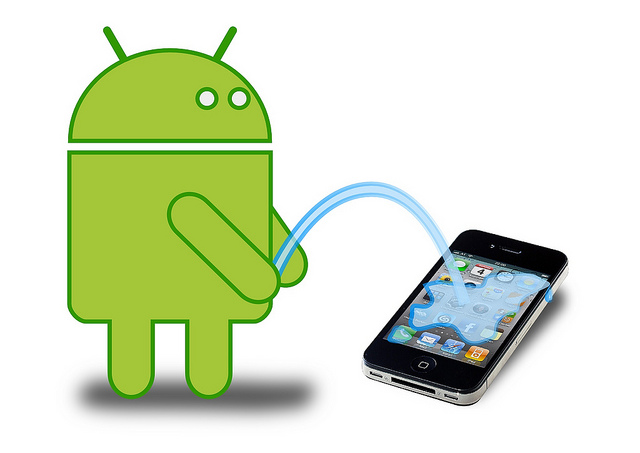
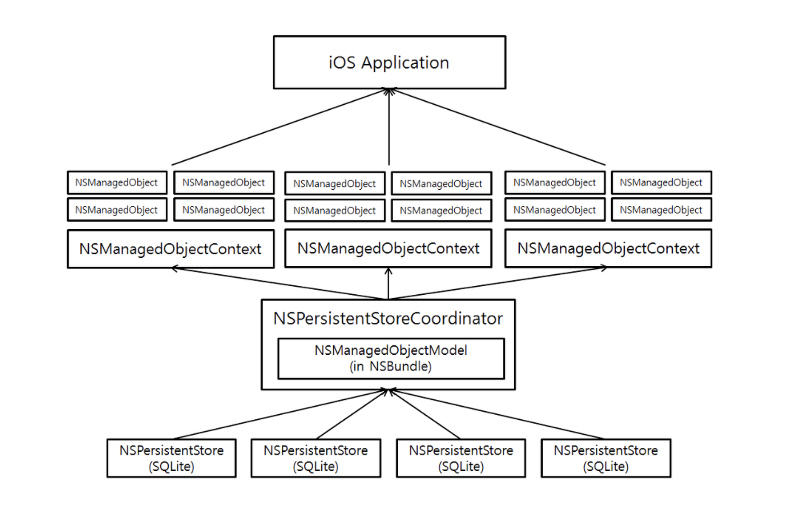

# Database in iOS




# Property List

- 사실상 데이터베이스는 아님
- 간단하고 짧으면서 Key-Value 형태(표준 딕셔너리)로 단순화할 수 있는 데이터의 저장을 위해 사용
- 객체 직렬화를 위한 XML 형식의 파일

- 앱의 공통 데이터나 주요 설정 정보 저장을 위해 주로 사용 

  > 마지막으로 열었던 문서, 파일에 대한 정보, 가장 많이 실행한 메뉴 정보,
  >
  > 환경 설정 데이터, 시스템 번들이나 애플리케이션 소프트웨어 정보...

- 추상화된 문자열 <string> 형태로 데이터 저장

- 누적 데이터를 관리하려면 배열 타입을 사용해야 하기 때문에 일부 데이터만 읽고 싶어도 항상 모든 데이터를 메모리에 들여와야 함. 단건의 데이터 갱신에 효율적. 

<br>

### UserDefaults

iOS에 앱을 설치하면 앱이 실행되는 시점에 데이터를 저장할 수 있는 영역인 기본 저장소가 생성됨 (Xcode에서는 확인 불가)

- 기본 저장소는 프로퍼티 리스트를 기반으로 하며 <App id>.plist 파일에 XML형식으로 데이터 저장
- iOS는 기본 저장소를 손쉽게 다룰 수 있는 UserDefaults 객체 제공 (런타임에서 동작, Singleton)

```swift
let plsit = UserDefaults.standard
plist.set(value, forKey: "name")
plist.synchronize()

var name = plist.string(forKey: "name")
```

<br>

### Custom Plist

필요에 따라서 직접 생성한 프로퍼티 파일에 데이터를 저장할 수 있음

애플리케이션의 샌드박스 내부 문서나 데이터 파일 전용 디렉터리에 저장되게 됨 (Documents)

- 공통의 데이터나 단순한 데이터라면 UserDefaults가 효율적
- 따로 그룹을 묶어서 저장해야 하거나 비슷한 형식의 데이터 그룹이 반복되는 경우에는 커스텀 Plist가 유용

- 하지만 너무 불편하다… 따라서 생략

> *샌드박스, 앱 도메인, App bundle, Documents 등 어플리케이션 구조에 관해 공부해 볼 필요가 있을 것*

<br>

# SQLite3

자세한 내용은 [database ](https://github.com/3zin/Today-I-Learned/blob/master/database/database.md)참고

- DBMS 자체는 작은 파일에 불과

- DB 파일 작성은 [*DB Browser for SQLite*](https://sqlitebrowser.org/) 같은 GUI 애플리케이션 툴을 사용하면 편함


### libsqlite3

-------------------

- Xcode에서 지원하는 SQLite 라이브러리

- 프로젝트 설정에서 libsqlite3 라이브러리를 추가하면 iOS에서 sqlite 사용 가능

**sqlite3** : DB 연결 정보가 저장되는 구조체

**sqlite3_stmt** : DB에 보낼 SQL 구문이 컴파일되어 저장되는 구조체

-> Swift에서는 둘 다 OpaquePointer 타입으로 사용 

```swift

let sql = "SQL QUERY ... "

var dbPath = "path ..."
var db: OpaquePointer? = nil
var stmt : OpaquePointer? = nil

// db를 연결. db 객체 생성
guard sqlite3_open(dbPath, &db) == SQLITE_OK else { 
 	return // error   
}

// DB 연결 종료. db 객체 해제 
defer {
   sqlite3_close(db)
}

// SQL구문을 전달할 준비. 컴파일된 SQL 구문 객체 stmt 생성
guard sqlite3_prepare(db, sql, -1, &stmt, nil) == SQLITE_OK else {
 	return // error   
}

 // 컴파일된 SQL 구문 객체 삭제. stmt 해제
defer {
    sqlite3_finalize(stmt)
}
    
// 컴파일된 SQL구문 객체를 db에 전달
if sqlite3_step(stmt) == SQLITE_DONE{
    //success!
}				 
```


### FMDB

------------

- 보다 고수준에서 데이터베이스 작업을 처리해주는 오픈소스 SQLite3 라이브러리 [fmdb](https://github.com/ccgus/fmdb)
- Objective-C로 구현, iOS와 코코아 터치 프레임워크의 특징을 반영해놓음
- libsqlite3을 재구성한 래퍼 라이브러리 


업데이트 구문은 executeUpdate 계열(Bool 반환), 쿼리 구문은 executeQuery 계열(결과 집합 반환) 메소드 사용

```swift
let db = FMDatabase(path: "file path...")

if db.open() == true {
    
    do{
        try db.executeUpdate("UPDATE SQL", values:["aaa", "bbb"]) // prepared statement
        let rs = db.exetuteQuery("QUERY SQL", values: [2]) // prepared statement
        
        while rs.next(){
            // deal with the data set using iterator pattern
        }
        
    } catch let error as NSERror {
        // error
    }
    
}
```

<br>

# Core Data

- 애플이 코코아 개발 환경을 통해 지원하는 인메모리(In-Memory) 데이터 관리 프레임워크
- 코어 데이터는 데이터베이스가 아니며, SQLite의 래퍼 역시 아님.


### 객체 그래프 관리자(Object Graph Manager)

----------

- 코어 데이터는 애플리케이션에서 모델 계층의 객체를 관리하는 데 사용하는 프레임워크이자, 라이프 사이클이나 영속성 관리를 위한 기능을 제공하는 객체 그래프 관리자. 일종의 프레임워크 (객체 관계 프레임워크)

- 영구 저장소에 저장된 각각의 레코드를 독립적이고 자체적인 생명 주기와 속성, 기능을 갖는 **객체**로 만들어냄
- 정규화된 데이터 객체 사이의 참조 관계를 통해 데이터를 서로 **영속적으로 동기화**하여 한 객체에서의 업데이트와 삭제를 **알림(notification)**을 통해 전파하며 관계의 완전성과 일관성을 보장. 데이터들을 일종의 그래프 형태로 파악. 
- 객체들이 할당되고 연결되었을 경우, 한 객체에만 접근이 가능하다면, 추가적인 불러오기(fetch) 없이 해당 객체로부터 나머지 연결된 객체들을 타고 넘어가면서 접근이 가능함. 일단 데이터들이 메모리에 로딩되면, 연결고리를 따라 이동하는 것은 검색 없이도 가능한 비검색(seachless)적 특성   *(독립된 테이블을 가져오기 위해 따로 조인 과정을 거칠 필요 없음)*


### Core Data의 특징

----------

#### 인 메모리(In-Memory)

- 모든 데이터가 원칙적으로 메모리에 로드되기 때문에 읽기 쓰기로 발생하는 영구 저장소 disk access 오버헤드가 줄어듦
- 영구 저장소로 SQLite, 바이너리 파일, XML 파일을 사용 가능하며, 완전한 인메모리 형태로도 사용 가능

> 코어데이터는 명시적으로 커밋(Commit), 동기화(Synchronize) 등의 저장 명령을 내릴때까지 디스크에 메모리에 로딩된 데이터를 저장하지 않는다. 즉, 코어데이터를 사용할때 “영속성”은 의무적인 기능이 아니다
>
> 맨 처음과 마지막에 한 번씩만 영구 저장소에 접근하여 반영하고 나머지는 메모리에서 처리하기 때문에 I/O가 적게 발생하여 빠른 처리 속도와 성능의 향상을 제공한다 *(다만, 영구 저장소로 SQLite 사용 경우 데이터 컨버전 오버헤드 발생 가능)*

- SQLite 영구 저장소와 컨텍스트의 관리 객체 커밋에는 미러링을 통한 차등 저장(Differencial Save) 메커니즘이 사용됨


#### 코어 데이터의 한계

 **(1)** **데이터를 메모리에 로딩하는 과정 없이 작업이 불가능함**

- 조건에 부합하는 최소한의 데이터만 메모리에 로드해 작업을 수행하는 온 디스크 방식과 구별

- 데이터 삭제를 위해서도 객체를 메모리에 로딩하여 삭제해야 함. 메모리 사용량의 증대

  > 추가적인 메모리 관리 필요 (returnDistinctResult, propertiesToFetch, refresh)

 **(2) 데이터 로직을 다루는 데 한계가 있음** 

- 중복 값의 입력을 방지하는 'Unique' 키와 같은 기능을 제공하지 않아 따로 처리해주어야 함
- 구조적으로 관리 객체 모델을 서브 클래싱한 하위 클래스에서 데이터 로직을 오버라이드 할 수 있기 때문에 불가능

**(3) 멀티 스레드, 멀티 유저를 지원하지 않음**

- 원칙적으로 싱글 스레드만 지원. 싱글 유저만 지원.
- 락(Lock)을 통한 데이터베이스 성능 저하를 방지하기 위하여


#### 기타

- 시각적인 모델 편집기를 통해 데이터 객체 모델링
- 더 나은 성능과 유연성을 위해 트랜잭션 모델을 따르지 않는다.
- 일대일, 일대다, 다대다의 객체 간 관계를 생성할 수 있다 (일반참조.. 역참조(Inverse)..)

| **데이터베이스(Database))**                                  | **코어데이터(Core Data)**                                    |
| ------------------------------------------------------------ | ------------------------------------------------------------ |
| 주된 기능은 데이터 저장/불러오기                             | 주된 기능은 객체 그래프 관리(하지만 디스크로의 읽기/쓰기 또한 중요한 기능들 중 하나) |
| 디스크에 저장된 데이터에 대해 작업 (필요에 따라 처리할 데이터만 최소한으로 메모리에 로드) | 메모리상에 로드된 객체에 대해 작업 (디스크로부터 lazy loading이 가능하긴 함) |
| 멍청한(dumb) 데이터를 저장                                   | 스스로 관리되는 완전한 객체를 다루며 서브클래싱을 통해 커스터마이즈된 동작 정의 가능 |
| Transactional, Thread safe, multi-user                       | Non-transactional, single threaded, single user              |
| 메모리에 로딩할 필요없이 테이블 삭제 및 편집 가능            | 무조건 메모리에 로드해야 작업 가능                           |
| 디스크에 영속적으로 저장 (에러에 강인함)                     | 별도의 저장 프로세스 필요                                    |
| 수백만 레코드를 생성하려면 오랜시간 소요                     | 메모리상에 객체 생성은 매우 빠르게 가능(디스크에 저장 하는 작업은 동일하게 오래 걸림) |
| “unique” key 와 같은 데이터 제약기능 제공                    | 데이터 제약기능은 프로그램 내부의 비지니스 로직에서 따로 구현해야 함 |

[출처](https://www.letmecompile.com/%EC%BD%94%EC%96%B4%EB%8D%B0%EC%9D%B4%ED%84%B0core-data%EC%99%80-%EB%8D%B0%EC%9D%B4%ED%84%B0%EB%B2%A0%EC%9D%B4%EC%8A%A4%EC%9D%98-%EC%B0%A8%EC%9D%B4/)


### Core Data의 구조

-----

#### 관리 객체(Managed Object)

- 관계형 데이터베이스에서의 테이블 레코드
- VO 패턴과 유사한 형태로 정의된 클래스 인스턴스 (MO 패턴)
- 클래스의 프로퍼티를 엔터티의 어트리뷰트와 직접적으로 연결시킴 (ORM 매핑)

#### 관리 객체 컨텍스트(Managed Object Context)

- DAO 객체의 역할

- 관리 객체를 담거나 생성, 삭제할 수 있으며 컨텍스트에 담긴 관리객체를 영구 저장소로 보내 저장할 수 있음. (CRUD 작업)
- 코어 데이터의 데이터가 ''메모리''에 로드되었다는 것은 곧 ''컨텍스트''에 데이터가 담긴 것을 의미함

#### 영구 저장소 코디네이터(Persistent Store Cordinator)

- 컨텍스트와 데이터를 주고 받으며 영구 저장소들의 접근을 조정하고, 해당 저장소에 대한 실제 입출력을 담당
- 미리 정의된 관리 객체 모델을 통해 인스턴스(관리 객체)를 생성하고 인스턴스에 읽어온 데이터를 담아 컨텍스트에 전달함

#### 관리 객체 모델(Managed Object Model)

- 데이터베이스에서 테이블의 구조를 정의하는 스키마
- 엔티티의 구조와 형식을 정의하는 클래스 (관리 객체 모델이 틀, 관리 객체가 구체적인 인스턴스)

#### 영구 객체 저장소(Persistant Object Store)

​	(1) 인메모리 저장소 타입 - 영구저장소 사용하지 않음. 데이터 객체의 런타임 캐싱에 활용

​	(2) 플랫 바이너리 저장소 타임 - 단순 바이너리 파일로 저장. 원자성 보장.

​	(3) XML 저장소 타입 - XML 방식으로 데이터를 변환하여 파일에 저장. 개발 초기 단계에 사용됨. 원자성 보장.

​	(4) SQLite 데이터베이스 - 기본적으로 코어 데이터가 채택하는 방식. 객체 그래프의 일부만 메모리에 로딩하기 




### 예시

---------

```swift
// CRUD of Core Data

func fetch() -> [NSManagedObject] { // you can use a custom MO class here
    let appDelegate = UIApplication.shared.delegate as! AppDelegate
    let context = appDelegate.persistentContainer.viewContext // 해당 영구 저장소의 컨텍스트
    let fetchRequest = NSFetchRequest<NSManagedObject>(entityName: "custom entity")
    let result = try! context.fetch(fetchRequest)
    return result
}

func save(title: String, contents:String) -> Bool {
    let appDelegate = UIApplication.shared.delegate as! AppDelegate
    let context = appDelegate.persistentContainer.viewContext 
    
    let object = NSEntityDescription.insertNewObject(forEntityName: "custom entity2", into: context)
    object.setValue(value, forKey: "custom key")
    
    do {
        try.context.save() // commit (Differencial Save)
        return true
    }catch {
        context.rollback() // abort
        return false
    }
}

// 컨텍스트에 로딩된 특정 데이터를 삭제하고 이를 동기화해야 함. save()
func delete(object: NSManagedObject) -> Bool {
    let appDelegate = UIApplication.shared.delegate as! AppDelegate
    let context = appDelegate.persistentContainer.viewContext
    context.delege(object)
    
     do {
        try.context.save()// commit (Differencial Save)
        return true
    }catch {
        context.rollback() // abort
        return false
    }
}


```


# Realm


- 떠오르는 모바일 데이터베이스

- 가능한한 타입과 구조 변환을 최소화하여 **객체를 직접** 디스크에 **유지하는 방식**

  

- ORM처럼 SQL 데이터베이스 테이블과 같은 이차원적 데이터를 오브젝트 그래프로 상호 변환할 필요가 없음

- SQLite처럼 서드파티 라이브러리로 네이티브 데이터 구조를 중간 형식으로 변환하고, SQL 쿼리를 실행하며, 데이터를 SQL 테이블 행으로 변환할 필요 없음

-  복잡한 엔티티에 대한 매핑 등 신속히 처리해야 할 다른 문제가 없으므로, Realm 모바일 데이터베이스는 메모리 상의 오브젝트를 디스크로 빠르게 가져올 수 있음

- Swift, Java, C#, Objective-C 등 지원

- RxSwift등과 호환하여 사용하기 편리함

  

```swift
// Realm Object <- Totally Class
// You have to use dynamic var for using Realm

class Repository: Object {
  dynamic var id: Int = 0
  dynamic var stars: Int = 0
  dynamic var url: String = ""

  dynamic var name: String?
  dynamic var favorite: Favorite?
}

let repos = realm.objects(Repository.self)
  .filter("name contains[c] %@", searchTerm)

class Repository: Object {
  dynamic var stars: Int = 0

  var starsDecorated: String {
    return "\(stars) ⭐️"
  }
}

extension Repository {
  static func all(searchTerm: String? = nil) -> Results<Repository> {
    let realm = try! Realm()
    return realm.objects(Repository.self)
      .filter("name contains[c] %@", searchTerm ?? "")
      .sorted(byProperty: "stars", ascending: false)
  }
}
```

*공부 해볼 필요가 있을듯!*


## Reference

어플리케이션 구조 공부용 참고 링크

https://soulpark.wordpress.com/2012/09/24/ios-file-system/

http://aroundck.tistory.com/4803


https://www.letmecompile.com/%EC%BD%94%EC%96%B4%EB%8D%B0%EC%9D%B4%ED%84%B0core-data%EC%99%80-%EB%8D%B0%EC%9D%B4%ED%84%B0%EB%B2%A0%EC%9D%B4%EC%8A%A4%EC%9D%98-%EC%B0%A8%EC%9D%B4/

https://code.tutsplus.com/ko/tutorials/core-data-and-swift-concurrency--cms-25118

http://beankhan.tistory.com/102