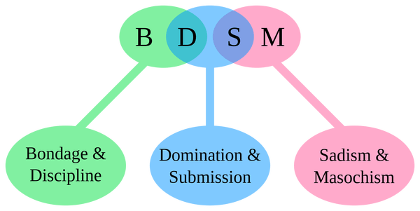

## RDBMS(Relational Database Management System)

 

- 관계형 데이터 베이스
- 데이터를 **칼럼(Column)** 과  **로우(Row)** 를 이루는 **<u>테이블</u>** 형식으로 처리하는 데이터베이스

- 같은 속성 항목(관계)을 가진 데이터들을 묶어 테이블로 구분해서 저장해 놓은 것
- 테이블은 복수의 칼럼(Column)으로 구성되며, 각 칼럼은 데이터를 하위 속성으로 나누어 저장함. (Skima)
- 테이블은 칼럼이 가질 수 있는 값에 규칙이나 범위를 설정할 수 있으며, 이를 **제약(Constraint)**이라 하고 칼럼이 가질 수 있는 값의 범위를 **도메인(Domain)**이라 부름
- 칼럼에는 데이터를 구별할 수 있는 식별자의 역할을 하거나 다른 테이블의 데이터를 의미적으로 연결 해주는 **키(Key)**가 존재 
- 데이터베이스에 입력되는 데이터들은 테이블에 로우 단위로 추가됨. 
- RDBMS를 위한 표준 언어가 SQL(Structured Query Language), 관계형이 아닌 DB는 NoSQL로 통칭

## RDBMS 관련 용어 정리

### Table vs Entity(Relation)

- 실무 관점에서는 동일. 엔터티가 보다 추상화된 개념(추상화된 구조 자체가 엔터티, 데이터베이스에 실제로 구현한 게 테이블)
- iOS의 관계형 데이터 관리 프레임워크 코어 데이터(Core Data)에서는 테이블을 엔티티로 표현

### Row vs Record

- 테이블의 각 행 단위 데이터를 가리키는 용어
- 테이블의 행은 위나 아래 행과 독립적이며, 하위 속성을 구성하는 하나 이상의 칼럼들의 집합으로 구성됨
- 각각의 레코드는 애플리케이션에서 특정 **객체**의 **인스턴스**로 처리되는 경우가 많음

### Column, Field, Attribute

- 테이블의 각 열 단위 데이터, 즉 하위 구조이자 하나의 레코드를 구성하는 속성/요소들
- 테이블-로우(레코드)-칼럼(필드)
- 엔터티-어트리뷰트

## 기본 키(Primary Key)

- 테이블 내의 유일값, 고유값(Unique)이 저장된 칼럼. 테이블 내 데이터 식별을 위해 사용

- <u>**유일성의 원칙**</u>을 지켜야 함

- > 조건 1 : 기본 키로 지정되는 칼럼은 값이 중복되지 않아야 함

- > 조건 2 : 기본 키로 지정되는 칼럼은 값이 비어 있거나 null이어서는 안됨

- 데이터 내부에 후보 키가 없다면, Auto Increment(Sequence)를 사용해서 생성 가능

- 복합 키(Complexed Key)를 사용할 수도 있으나, <u>**최소성의 원칙**</u>을 지켜야 함

  > 조건 3 : 기본 키로 지정되는 칼럼은 유일값을 유지할 수 있는 최소한의 칼럼으로 이루어져야 한다 (최소성의 원칙)

### PK 지정을 통해 얻을 수 있는 이점

(1) 인덱싱을 통한 검색 성능 향상 : PK 지정시 자동으로 클러스터형 인덱스가 생성 

(2) 물리적 장치에 의해 무결성 원칙 보장 (실수에 의한 값의 중복 입력 방지)

## 정규화

- 큰 테이블을 여러개의 조직된 테이블로 나누는 구조화 작업
- 데이터의 중복을 막고, 데이터의 갱신, 삽입, 삭제 과정에서 생기는 이상 현상을 방지하며, 데이터베이스 구조 확장시 테이블의 재설계 범위를 최대한 줄이는 것을 목표로 함
- 정규화 6단계로 이루어져 있으나, 3단계까지가 일반적 

### 제 1 정규화

- 도메인이 원자값
- 하나의 칼럼에 들어가는 값은 더 이상 쪼갤 수 없는 원자값이어야 한다

### 제 2 정규화

- 부분적 함수 종속 제거
- 기본 키가 A + B 칼럼으로 이루어진 복합 키일 경우, 나머지 칼럼들은 A와 B 칼럼 양쪽 모두에 종속되어야 한다

### 제 3 정규화 

- 이행적 함수 종속 제거
- 모든 칼럼은 기본 키에 종속되어야 하며, 기본 키가 아닌 일반 칼럼에 종속되는 칼럼이 있어서는 안된다

 

정규화 과정을 거치지 않은 테이블은 데이터의 갱신, 삽입, 변경 과정에서 **이상(Anomaly)**이 발생할 수 있음 

중복된 데이터에서 갱신 누락을 통해 발생하는 불일치인 **갱신 이상**

부분적인 데이터를 삽입하기 위해 다른 칼럼을 모두 비워 두어야 하는 **삽입 이상**

일부 데이터의 삭제로 인해 원치 않은 묶여있는 데이터까지 함께 삭제되는 **삭제 이상**

= 테이블을 쪼개어 그룹별로 정보를 별도의 테이블로 분류하고, 논리적으로 서로 연결이 가능하도록 공통 정보를 남겨두어야 함 

- 현재 테이블의 기본 키가 아니면서 다른 테이블의 기본 키가 되어 테이블을 연결해주는 역할을 하는 칼럼 : **외래 키(Foreign Key)**
- 한 테이블의 칼럼이 다른 테이블의 외래 키로 연결되어 다른 테이블에서 기본 키의 역할을 하므로, 변경되지 않을 값을 찾아서 외래 키(연결되는 테이블의 기본 키)로 지정해야 함. 

## Reference

친절한 재은씨의 Swift 실전편

https://ko.wikipedia.org/wiki/%EA%B4%80%EA%B3%84%ED%98%95_%EB%8D%B0%EC%9D%B4%ED%84%B0%EB%B2%A0%EC%9D%B4%EC%8A%A4

http://tcpschool.com/mysql/mysql_intro_relationalDB