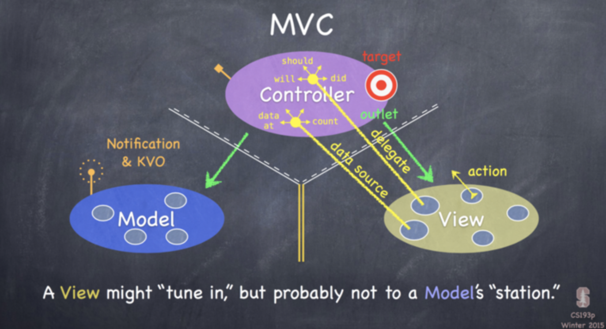
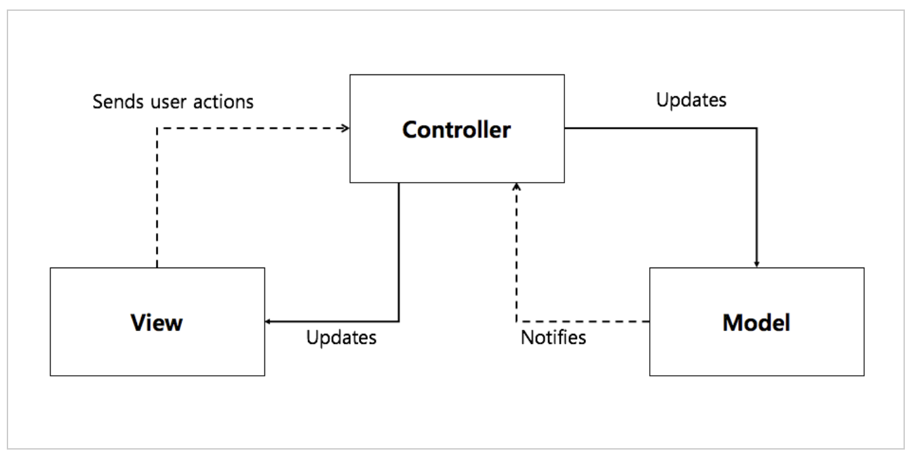
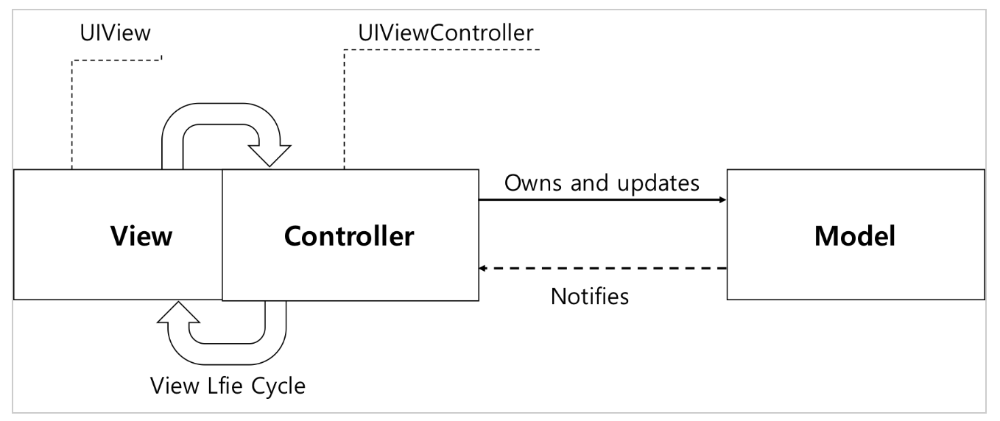

# Model View Controller (MVC)


## MVC란 무엇인가

- MVC 패턴은 가장 기본이 되는 소프트웨어 구조 디자인 패턴으로, Model-View-Controller의 줄임말
- 프로그램을 구성하는 요소를 데이터(Model), 화면(View), 컨트롤러(Cotroller)로 나누어 관리한다


## Model

데이터와 비즈니스 로직을 가지고 있는 객체 (Class, Object)

애플리케이션의 모든 정보, 비즈니스 로직, 데이터베이스, 네트워크 등을 담당하고 데이터를 정합하게 가공한다

원칙적으로 뷰나 컨트롤러에 접근할 수 없다. 특히 View에 대한 참조정보를 가지고 있어서는 안된다(이는 Apple의 MVC에서 강조되는 MVP적 특징이다)

자신의 컨트롤러가 누구인지 알 수 없다


cf. 비즈니스 로직이란 업무에 필요한 데이터 처리를 수행하는 응용프로그램의 일부를 말한다. 이것은 데이터 입력, 수정, 조회 및 보고서 처리 등을 수행하는 루틴, 좀더 엄밀히 말하면 보이는 것의 그 뒤에서 일어나는 각종 처리를 의미한다.


## View

사용자에게 보여지는 화면. UI를 담당한다 (Main.storyBoard, xib)

뷰는 단순히 전달받는 데이터를 화면에 표시할 뿐, 다른 요소에 대한 참조정보를 가지고 있어서는 안된다 

자신의 컨트롤러가 누구인지, 어떤 데이터가 표시될 것인지 알 수 없다


## Controller 

독립적인 Model과 View 사이의 동작을 관리한다. (UIViewController...)

Model과 View에 대한 참조 정보를 갖고 있어야 한다. Model이나 View의 변경을 모니터링해야 한다

View로 입력된 사용자 입력을 Model에 전달하고, Model에서 갱신된 값을 View로 전달한다

컨트롤러:뷰 의 관계는 1:n의 관계이다

가장 재사용이 힘든 편


## MVC in iOS




- Apple은 MVC 개발을 선호한다. FrameWork 자체가 MVC 구조로 짜여져 있다. 
- Model과 View는 철저히 독립적이여야 한다
- Controller에서 View로의 접근, Controller에서 Model로의 접근은 가능하다.
- 경우에 따라, 원칙에는 위배되지만 반대로 Model이나 View에서 Controller로 접근하는 것이 허용된다. 


### 1. Controller to View : Outlet

- Controller는 해당 View의 인스턴스를 만들어 IBOutlet 등의 형태로 내부에서 관리한다 

- Outlet을 통해 Controller는 View에게 "너가 보여줄 데이터는 이 것이다" 와 같은 구체적인 지시를 하게 된다. 

  ```swift
  My_Controller : UIViewController{
  
      // View를 outlet의 형태로 끌어와 Controller 내부에 포함시킨다 
  	@IBOutlet weak var my_text : UILabel! 
  	@IBOutlet weak var my_image : UIImageView!
  
  	my_text.text = "hello world!" // view에게 표시할 데이터를 지시한다 
  	my_image.image = UIImage(named: "hello.png")
      
  }
  ```


### 2. Controller to Model : Instance

- Controller는  역시 해당 Model class의 인스턴스를 만들어 내부에서 관리한다


### 3.1. View to Controller : IBAction(Target-Action)

- **유저**가 View를 통해 특정한 메시지를 던질 경우, View는 Controller에게 제한적으로 말을 걸 수 있다

- Target-Action 

- Controller는 미리 자신 내부에 Target을 설정해 놓고, View에게 그 Target에 적용할 수 있는 Action을 제공한다

  ```swift
  @IBAction func button_pushed(){
      // ... Target modified ... 
  }
  ```

  *Q. 과연 좋은 방식일까?*

  *Q. GestureRecognizer은 특정 버튼에 국한되지 않은 **전체 view**에 대한 포괄적인 IBAction으로 생각하면 되나?*


### 3.2. View to Controller : Delegate 

- 유저가 View에 특정한 메시지를 던질 경우, 그에 대한 처리를 Delegation Protocol을 통해 Controller에 위임한다
- 개념상 View Class 안에 Controller instance를 만드는 것과 유사하지만, class가 아닌 protocol을 사용한다 
- 유저가 특정한 행동을 할 경우 view로부터 Controller로 다음과 같은 Delegation Protocol이 호출된다 
  1. will ~ : 입력을 막 하려는 순간
  2. did ~ : 입력을 막 한 이후
  3. should ~ :  입력을 하도록 할 것인지 
  4. dataAt ~ :  해당 View가 표시해야 할 데이터가 무엇인지
  5. count ~ : 해당 View에 총 몇 개의 데이터가 존재하는지

- 4~5번은 dataSource로 따로 분류한다 

  

  ```swift
  class my_Controller : UIViewController, UITableViewDelegate, UITableViewDataSource {
      
      @IBOutlet weak var tableView: UITableView! // Controller to View
      
      override func viewDidLoad() {
        super.viewDidLoad()
          
        // instance의 형태로 연결된 View의 delegate/dataSource를 self(Controller)로 위임한다 
        self.tableView.delegate = self   
        self.tableView.dataSource = self 
      }
      
      func tableView(UITableView, didSelectRowAt: IndexPath){
          // View에서 특정한 입력이 발생되면, delegation에 의해 
          // 본 함수가 호출되게 되어 Controller가 입력을 대신 처리하게 된다. 
      }
  }
  ```

  *hint. target을 따로 설정하지 않는다는 측면에서 Target-Action의 방식보다 보다 포괄적이고 일반적인 측면이 있다*


### 4. Model to Controller : Notification(KVO, RxSwift)

- Model은 원칙적으로 내부 데이터를 관리하는 것을 담당하지만, Model의 값이 바뀌었을 경우 이에 대한 처리를 Controller에게 요청해야 한다

- Notification이나 KVO(Key-Value-Observation) 을 통해 Controller에게 자신의 값이 바뀌었다는 사실을 고지한다

- 이와 같은 Model에서의 비동기적(Asynchronous) 작업을 Controller가 받아서 처리하는 방식이 중요하다

  (예를 들어, 어떤 무거운 프로그램을 multi-threading 환경에서 background에서 돌리다가 그 작업이 비동기적으로 완료되었을 때 컨트롤러에서 이를 인지하고 처리해주는 과정이 필요함)

  

  = " <u>**Observer Pattern**</u>" : 이후에 더 큰 주제로 정리할 것....


*Q. Passive Model, Active Model?*


## 왜 MVC를 사용하는가

- 분리를 통해 개체들간의 책임을 분담하여 사고할 수 있다
- 유지보수가 간편해진다
- 생산성이 매우 좋아진다
- 재사용이 가능하다
- UI/Logic/Controller 각각의 단위 테스트(Unit test)가 가능해진다


## MVC의 단점 (어쩌면 iOS MVC의 단점)



>  일반적인 MVC




> Apple의 MVC

---

- Apple의 Cocoa MVC에서, View와 Controller는 뒤엉켜서 잘 분리되지 않는다 
- 기본적으로 View와 Controller는 하나의 덩어리인 'ViewController' 로 동작한다 
- 기본적으로 Cocoa MVC의 Controller는 UIViewController를 상속하고, 따라서 ViewDidLoad등의 View LifeCycle Delegation에 필연적으로 종속된다. 
- View의 생명주기와 관련된 코드가 모두 Controller에 위치하고, 모델이 담당해야 할 네트워크 통신, 다운로드, 데이터 처리 역시 ViewController에 위치하게 되는 경우가 많다. ViewDidLoad() 등의 생성주기 함수가 길어진다
- 필연적으로 Controller가 비대해진다 (**Massive View Controller**)
- 한마디로 M + VC의 느낌

---

이로 인해 발생하는 문제점들 

1. 당신의 데이터들이 UIViewController에서 바로 저장된다.
2. UIView들이 거의 아무 일도 하지않는다.
3. Model이 빈 데이터 구조이다.
4. 뷰 컨트롤러가 뷰 라이프 사이클과 엮여있어 재사용이 불가능하다
5. 뷰와 컨트롤러의 상호작용(user action)은 테스트할 수 없다. 

 

## 해결방안 

- [MVP](./model_view_presenter.md)
- MVVM
- VIPER
- ReSwift
- RxSwift (React...)

... to be continued


## Reference

https://medium.com/ios-development-with-swift/mvc-%ED%8C%A8%ED%84%B4-in-ios-7751911f8ca8

https://jdub7138.blog.me/220937372865


further reading

https://jdub7138.blog.me/220937372865

https://medium.com/ios-os-x-development/ios-architecture-patterns-ecba4c38de52

http://canapio.tistory.com/43  <- 번역버전

https://medium.com/nspoons/%EC%95%88%EB%93%9C%EB%A1%9C%EC%9D%B4%EB%93%9C-architecture-%ED%8C%A8%ED%84%B4-part-1-%EB%AA%A8%EB%8D%B8-%EB%B7%B0-%EC%BB%A8%ED%8A%B8%EB%A1%A4%EB%9F%AC-model-view-controller-881c6fda24d9

http://cescjuno.tistory.com/entry/IOS-architecture

https://academy.realm.io/kr/posts/krzysztof-zablocki-mDevCamp-ios-architecture-mvvm-mvc-viper/

http://labs.brandi.co.kr/2018/02/21/kimjh.html