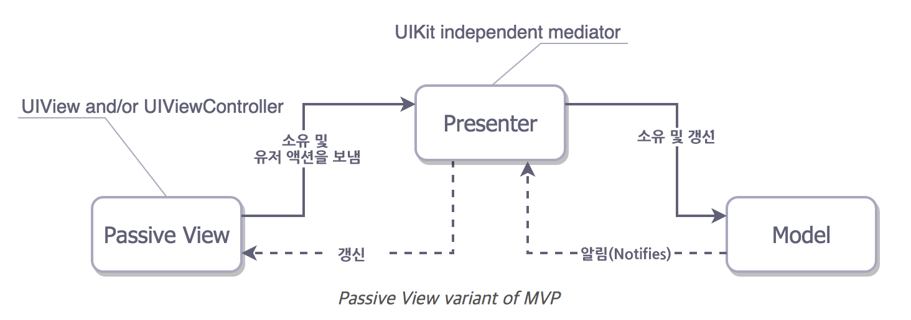

# Model View Presenter (MVP)


## MVP란 무엇인가

- MVP는 MVC의 한계를 극복하기 위해 제시된 소프트웨어 디자인 패턴이다 

- iOS에서 View와 Controller는 뒤엉켜서 하나의 덩어리인 'ViewController'로 동작한다

- (View)Controller는 필연적으로 View의 생성주기 속에서 뒤얽히게 되고, Controller는 View에 종속되며, 이 둘을 분리할 수 없다.

  

- 예시를 살펴보자 ([출처](https://medium.com/ios-os-x-development/ios-architecture-patterns-ecba4c38de52#.wtcp3gqzw))

```swift
import UIKit struct Person { // Model 
    let firstName: String 
    let lastName: String 
} 

class GreetingViewController : UIViewController { // View + Controller
    
    var person: Person! // Controller가 갖고 있는 Model에 대한 정보
    let showGreetingButton = UIButton() 
    let greetingLabel = UILabel() // Controller가 갖고 있는 View에 대한 정보 
    
    override func viewDidLoad() { 
        super.viewDidLoad() 
        self.showGreetingButton.addTarget(self, action: "didTapButton:", forControlEvents: .TouchUpInside) 
    } 
    
    func didTapButton(button: UIButton) { 
        let greeting = "Hello" + " " + self.person.firstName + " " + self.person.lastName 		  self.greetingLabel.text = greeting 
    }
    
    // 보다시피, 사용자의 입력을 받아서 View의 내용을 갱신하는 모든 작업이 'ViewController' 내부에서 처리된다.
    // 뷰가 많아지거나 코드가 길어질 경우 장황해질 가능성이 있다
    
    // layout code goes here (Controller에서 Layout을 담당...)
} 

// Assembling of MVC 
let model = Person(firstName: "David", lastName: "Blaine") 
let view = GreetingViewController() 
view.person = model;

```


#### **눈에 띄는 문제점**

1. View와 Controller가 분리되지 않음

2. 예를 들어, 사용자의 입력이 들어오면 호출되는 didTapButton() 에서 바로 구체적인 View 객체(greetingLabel)에 접근해서 값을 수정함. 

   이는 사실상 Controller를 거치지 않고 View에서 입력을 받아 View에서 처리하는 방식

   View 객체가 많아질 경우 Controller 하나가 수많은 View를 담당해야 하는데 그럴 경우 Passive View와 Controller의 책무 관계가 애매하고 장황해지며 ViewController가 거대해진다. 

3. Controller와 View가 얽혀있기 때문에, UIView와 관련되어 있는 메소드 ViewDidLoad(), didTapButton() 가 호출되지 않을 경우 Controller의 기능을 테스트할 수 없다. Unit Test가 불가능하다. 

----


## 그래서 MVP란 무엇인가

- MVP는 이와 같은 Cocoa MVC의 한계를 극복하기 위해 고안된 디자인 패턴이다
- Model-View-**<u>Presenter</u>**




> Apple의 MVP

---

- Controller의 자리를 **Presenter**가 대체한다 
- ViewController가 Passive View의 역할로 국한된다 (ViewController => View). ViewController에서 Controller의 역할을 Presenter로 분리하는 느낌 
- **Presenter**는 View(Controller)의 라이프 사이클에 아무런 영향을 끼치지 않으며, View 영역과 독립적으로 자신만의 복사본을 만들어 Unit Test를 할 수 있다. 이는 View도 마찬가지다
- 따라서 Presenter는 레이아웃 정보를 담고 있지 않으며, 오직 View와 상태와 데이터를 갱신하는 중간자의 역할을 담당한다.
- View는 Controller가 전달하는 내용을 그대로 보여주는 극도로 수동적인 빈 껍데기가 된다 
- 각각의 View마다 개별적인 Presenter가 연결되어야 한다 (1:1 관계)     ***Q. Why?***
- 따라서 모든 View와 Presenter는 사전에 정의된 protocol을 따라 일관성을 갖고 개별적으로 만들어지게 된다  


- 예시를 살펴보자 

```swift
import UIKit struct Person{ // Model 
	let firstName: String 
    let lastName: String 
} 

protocol GreetingView: class { // Protocol for View
    func setGreeting(greeting: String) 
} 

protocol GreetingViewPresenter { // Protocol for Presenter
    init(view: GreetingView, person: Person) 
    func showGreeting() 
} 

class GreetingPresenter : GreetingViewPresenter { // Presenter for only 'GreetingView'
    unowned let view: GreetingView // View에 대한 정보
    let person: Person 			   // Model에 대한 정보
    
    required init(view: GreetingView, person: Person) { 
        // ViewDidLoad()등과 독립적. 따라서 UnitTest가 가능 
        self.view = view 
        self.person = person 
    } 
    
    func showGreeting() { 
        let greeting = "Hello" + " " + self.person.firstName + " " + self.person.lastName self.view.setGreeting(greeting) 
        // 구체적인 View에 구애받지 않고, 프로토콜에 정의된 setter 함수를 호출함으로 재사용성이 높아지며, 
        // Presenter-> View로 이어지는 호출의 상하관계를 드러낸다
    } 
} 

class GreetingViewController : UIViewController, GreetingView { // Passive View
    var presenter: GreetingViewPresenter! // Presenter에 대한 정보
    let showGreetingButton = UIButton() 
    let greetingLabel = UILabel() 
    
    override func viewDidLoad() { 
        super.viewDidLoad() 
        self.showGreetingButton.addTarget(self, action: "didTapButton:", forControlEvents: .TouchUpInside) 
    } 
    
    func didTapButton(button: UIButton) { // 빈 껍데기. Presenter가 값 갱신을 담당한다
        self.presenter.showGreeting() 
    } 
    
    func setGreeting(greeting: String) { // Presenter에 의해 수동적으로 호출됨
        self.greetingLabel.text = greeting 
    } 
    
    // layout code goes here 
} 

// Assembling of MVP 
let model = Person(firstName: "David", lastName: "Blaine") 
let view = GreetingViewController() 
let presenter = GreetingPresenter(view: view, person: model) // presenter는 view와 model의 참조정보를 갖는다
view.presenter = presenter // view는 presenter의 참조정보를 갖게 된다 (for IBAction)
```


이를 통해 확인할 수 있는 MVP의 장점은 다음과 같다

1. 명확히 구분되는 세 개의 레이어를 가진다. (View - Presenter - Model)
2. View는 수동적인 역할로 국한된다. (빈 껍데기) Presenter과 IBAction이나 Delegate 패턴을 통해 소통한다. 
3. View(User) -> Presenter -> Model -> Presenter -> View로 이어지는 호출의 상하관계가 명확히 드러난다
4. 프로토콜을 따르는 한 View / Presenter 사이의 관계가 깨지지 않고 재사용성, 유지보수가 가능해진다.
5. View가 독립적이므로 Mock Test가 가능하다  ***Q. How? What's Mock Test***

 

물론 단점도 있다

1. 코드가 길어지고 class가 많아진다
2. Binding이 필요하다. ***Q. Binding? 애초에 View-Presenter가 1:1이 되어야 하나?***


## 해결방안

- MVVM
- VIPER
- ReSwift
- RxSwift (React...)

... to be continued


## Reference

http://canapio.tistory.com/43

https://magi82.github.io/android-mvc-mvp-mvvm/

http://www.priyaontech.com/2017/01/mvc-mvp-and-mvvm-patterns-on-ios/


further reading

http://iyadagha.com/using-mvp-ios-swift/ <- 서버 통신 조금 배우고 반드시 다시 읽어볼 것