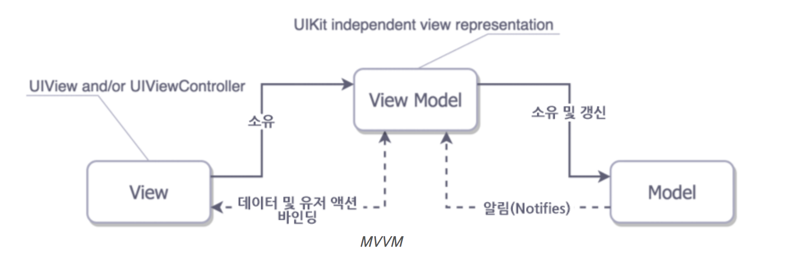
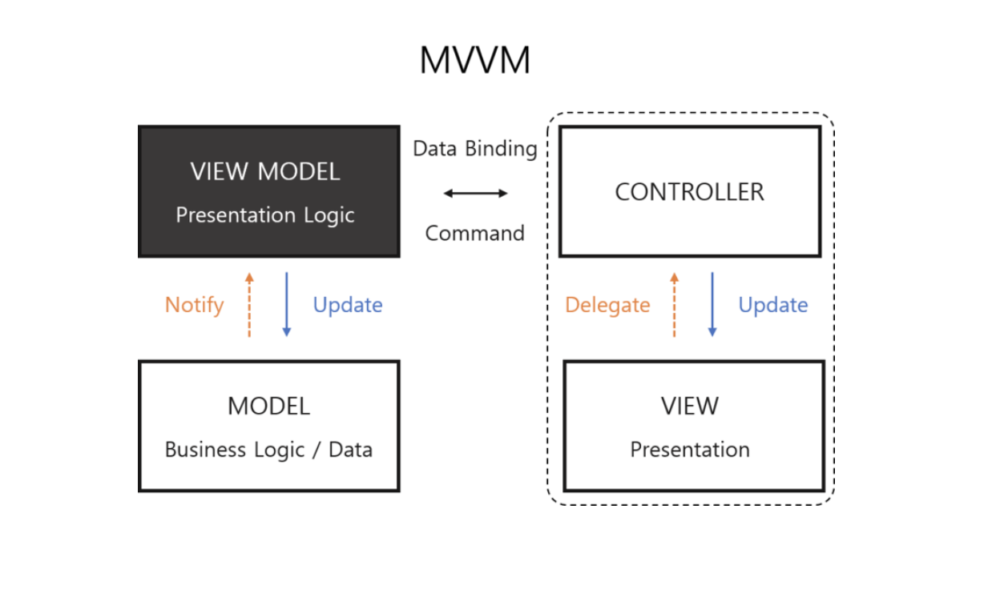

# Model View ViewModel (MVVM)

## MVVM란 무엇인가

- MVVM은 Model-View-View Model의 약자로, MVC에 대한 대안으로 나온 디자인 패턴

- iOS환경에서 View와 Controller가 서로 분리되지 못하여, 대부분의 포매팅 관련 코드가 Controller에 들어감으로 인해 발생하는 Massive View Controller의 문제를 해결하기 위해 등장한 디자인 패턴

  

  

[출](http://canapio.tistory.com/43)[처](https://jdub7138.blog.me/220937372865)

## MVC, MVP와의 차이점

- iOS의 Controller와 View를 합쳐서 View로 인식한다
- View Model이라는 새로운 매개가 Model과 View를 매개한다
- View와 Model이 서로 연결되어있지 않으며, **데이터 바인딩**이 View와 View Model 사이에 설정된다 (MVP의 경우 View와 Model 사이에 설정됨)
- View Model은 Model을 소유하고 있으며, Model 자체의 값을 갱신하며, Model에게서 알림(Notification)을 받기도 한다
- View Model은 Presentation Logic을 다루지만, UI관련 로직은 View에서 다루게 된다. **(UIKit import 금지)**
- MVP + Data Binding의 느낌

MVVM의 간단한 흐름은 다음과 같다 [출처](https://swifter.kr/2017/04/22/%EB%AA%A8%EB%B0%94%EC%9D%BC-%EC%95%B1-%EC%95%84%ED%82%A4%ED%85%8D%EC%B2%98/)

- 사용자가 문자를 입력한다.
- 입력된 문자가 자동으로 ViewModel에 바인딩된다
- ViewModel이 Model에 변경요청한다.
- Model에서 무엇인가를 처리한다. (변경 알림 전달) <- **Observable**
- ViewModel값을 변경하면 자동으로 View도 바인딩된다

## MVVM의 예시

// 이후 추가

## 데이터 바인딩이란 무엇인가

- 직관적으로, View와 View Model의 값을 동일하게 묶어(Binding)주는 것 (*Q. View Model과 Model 사이의 변화는?*)
- 어느 한 쪽에서 값이 변하면 다른 쪽에서도 값이 변한다. 객체간의 소통과 관련 있을 듯.
- 바인딩은 KVO(Key-Value-Observing)이나 Notification에 대한 일종의 대안이다
- Delegate, KVO(Callback), Notification도 객체간의 소통을 지원하며 Binding과 비슷한 역할을 하지만, 여기서 말하는 데이터 바인딩이란 이보다 더 확실한 Bond로서 일종의 함수형 반응 프로그래밍(FRP)인 Reactive (RxSwift, ReactiveCocoa, Bond)를 지칭하는 듯 하다. 
- Reactive란 결국 Observable 디자인 패턴을 적극적으로 사용하는 것. MVVM의 핵심은 Rx

## Reference

https://jdub7138.blog.me/220937372865

https://jdub7138.blog.me/220983291803

https://swifter.kr/2017/11/09/uitextview-%EC%9D%BC%EB%B6%80-%ED%85%8D%EC%8A%A4%ED%8A%B8%EC%97%90-%EB%A7%81%ED%81%AC-%EC%B6%94%EA%B0%80%ED%95%98%EB%8A%94-%ED%8C%81/

Further Reading

http://artsy.github.io/blog/2015/09/24/mvvm-in-swift/

https://academy.realm.io/kr/posts/doios-natasha-murashev-protocol-oriented-mvvm/ 

<- Protocol-orientedMVVM

https://medium.com/@azamsharp/mvvm-in-ios-from-net-perspective-580eb7f4f129

http://kka7.tistory.com/83?category=960098

