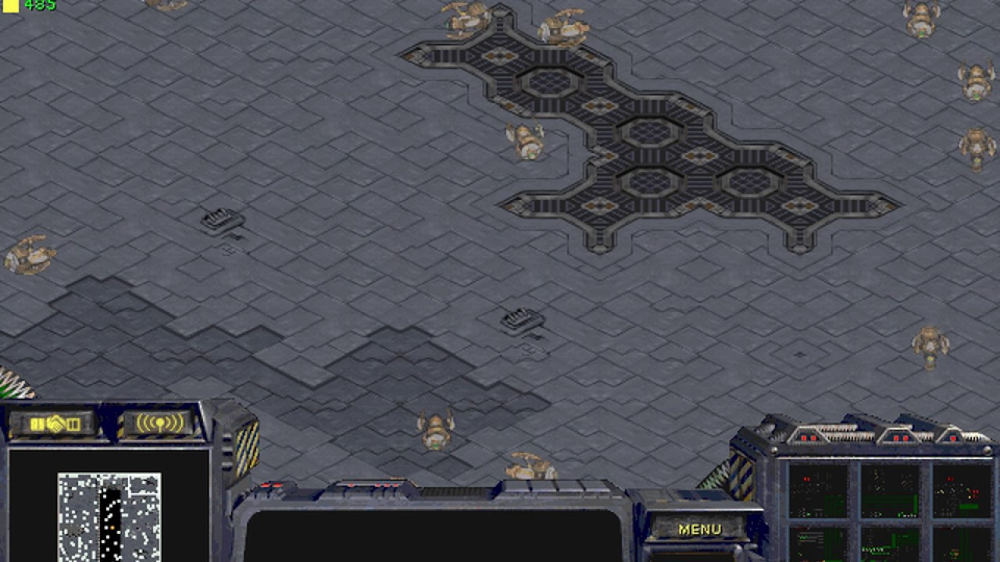
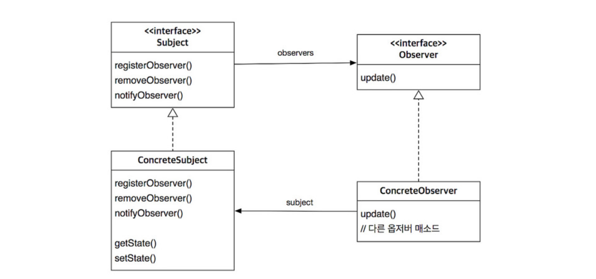
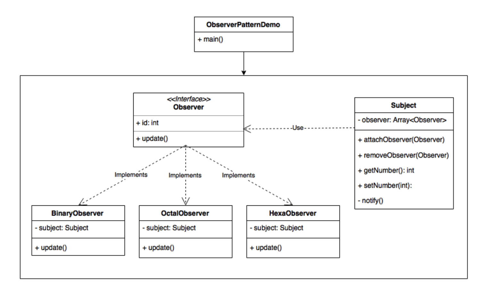

# Observer



- 디자인 패턴 용어
- 상태변화를 감지하는 관찰자들, 즉 옵저버들의 목록을 주 객체(Subject)에 등록하여 상태 변화가 있을 때마다 메서드 등을 통해 주 객체가 직접 목록의 각 옵저버에게 통지하도록 하는 디자인 패턴
- Subject에 변화가 일어났을 경우, 주 객체를 구독하고 있던 모든 객체(Observers)들은 알림(notification)을 받게 된다
- 객체들 간에 일대 다 관계가 있을때 주로 사용됨 
- 주로 분산 이벤트 핸들링 시스템을 구현하는 데 사용된다. 발행/구독(subscribe) 모델로 알려져 있기도 함

<br>

## Basic of Observer Pattern

옵저버 패턴은 크게 **주 객체**와 주 객체에 의존적인 **옵저버** 두 개의 클래스로 구성됨.

주객체 클래스에는 쉽게 옵저버를 추가하고 삭제할 수 있는 매소드(attachObserver, removeObserver)를 포함시키고, 옵저버에게 주 객체의 상태가 변경되었음을 알리는 메소드(notify)도 추가함

옵저버는 주 객체의 상태가 변경되었을때 자신의 상태를 변경하기 위한 update() 메소드를 추가 하고 프로토콜로 구현함.

주 객체는 객체에 등록된 옵저버가 무엇인지 파악하기 위해서 옵저버를 가지고 있어야 하고, 옵저버 또한 자신이 어떤 주 객체에 등록되어 있는지 파악하기 위해서 주 객체 정보를 가지고 있음.

주 객체와 옵저버 객체 사이에 순환 참조가 일어나고 있음

> 옵저버 객체의 삭제는 removeObserver() 메소드로 처리한다고 하여도
>
> 주 객체가 사라질 경우, 옵저버 객체는 소멸된 객체를 참조하여 Retain Problem이 생길 수 있음. 소멸되기 전에 자신이 소멸된다는 사실을 옵저버에게 알리는 등의 행동 필요 

이 주 객체와 옵저버 객체는 비록 상호작용을 하고 서로에 대한 정보를 가지고 있지만, 그냥 그것이 어떤 인터페이스로 이루어져있다 는 최소한의 정보만 가지고 있음. 이것을 **느슨하게 결합(loosely coupled)**되어 있다고 함.

느슨한 결합의 장점

> 1. 언제든지 원하는때에 옵저버를 추가할 수 있음 
> 2. 옵저버를 추가하기 위해서 주 객체를 변경할 필요가 전혀 없음
> 3. 주 객체나 옵저버 객체가 느슨하게 연결되어 있기 때문에 주 객체나 옵저버 객체를 재사용할 수 있음 
> 4. 주 객체를 변경하거나 옵저버를 변경하는 것이 서로에게 전혀 영향을 끼치지 않음(side effect 가 전혀 없음)

> [디자인 원칙]
> 상호작용하는 오브젝트 간에 느슨한 결합이 되도록 최대한 노력

주 객체는 통상 1개만 존재하므로 Singleton 패턴과 같이 쓰이는 경우도 있음






*UML example*

> iOS는 내부적으로 Notification Center와 KVO를 통해 Observer 패턴 api를 제공해주고 있다. 
>
> Notification Center은 "Notification Center"라는 Singleton 주 객체(Subject)를 사용한다, 따라서 알람은 모든 observer에게 동일한 형태로 다 전달되고, 옵저버는 내부 조건문을 통해 이를 처리하기 때문에 비효율이 발생할 수 있음
>
> KVO는 Key-Value를 사용. 주 객체의 이벤트를 각각 특정 Key로 분류하고, 해당 키에 딸린 Value들에 옵저버들을 할당해서 따로따로 관리하는 방식일 것. 

> 하지만 Rx를 더 많이 씀


주 객체가 상태를 전달하는 방법은 두 가지가 있음 

**(1) PULL 모델**

- Subject 객체는 값이 변경되었다는 사실만을 통보하고 Observer 객체가 값을 받아가는 형식 (옵저버에게 위임)
- 데이터 값이 변경되었다는 통보와 실제 변경된 데이터를 가져오는 과정이 분리되어 **효율**이 떨어짐
- Update() 메소드를 항상 동일한 **인터페이스(프로토콜)**로 사용할 수 있다는 이점 존재

**(2) PUSH 모델**

- Subject 객체가 값을 변경하였다는 사실을 통보하며 Observer 객체에게 변경된 데이터 값을 동시에 전달함
- notify() 메소드 안에서 update()시 변경된 데이터 값을 인자로 전달.
- updata() 멤버변수 인터페이스가 동일하지 않을 수 있음

*예시는 PULL*

<br>

## Example of Observer Pattern in Swift

**Observer Protocol (Observable)**

```swift
protocol Observer{
    var id : Int{ get }
    func update()
}
```


**Subject Protocol (Subjectable)**

```swift
protocol Subject{
    func attchObserver(observer: Observer)
    func removeObserver(observer : Observer)
    private func notify()
}
```


**MySubject Object**

```swift
class MySubject : Subject{
    
    private var observerArray = [Observer]() // Observe 인터페이스 정보를 private 변수로 갖고 있다
    private var _number = Int()
    var number : Int {
        set {
            _number = newValue
            notify()
        }
        get {
            return _number
        }
    }
    
    func attachObserver(observer : Observer){
        observerArray.append(observer)
    }
    
    private func notify(){
        for observer in observerArray {
            observer.update()
        }
    }
    
    func removeObserver(observer : Observer) {
    	observerArray = observerArray.filter{ $0.id != observer.id } 
        // functional programming (FRP)
	}
    
}
```


**BinaryObserver Object**

```swift
class BinaryObserver : Observer{
    
    private var subject = Subject() // Subject 인터페이스 정보를 private 변수로 갖고 있다
    var id = Int()

    init(subject : Subject, id : Int) {
        self.subject = subject
        self.subject.attachObserver(observer: self)
        self.id = id
    }
    
    func update(){
        print("Binary: \(String(subject.number, radix: 2))")
    }
    
}
```

```swift
let subject = Subject()

let binary = BinaryObserver(subject: subject, id: 1)
let octal = OctalObserver(subject: subject, id: 2)
let hex = HexaObserver(subject: subject, id: 3)

subject.number = 15
subject.removeObserver(observer: binary)
subject.number = 2

/*
Binary: 1111
Octal: 17
Hex: f
Octal: 2
Hex: 2
Program ended with exit code: 0
*/
```

<br>

## 장점과 단점

장점

- 주제와 옵저버의 느슨한 결합으로 상호 의존성으로 인한 문제가 없음. 독립적 재사용 가능. 삭제 추가 자유로움.
- 서로 영향을 주는 객체들간의 의존 관계를 분산시킬 수 있음
- 언제 바뀔지 모르는 데이터를 풀링하지 않고 푸쉬스타일로 필요한(변경된) 시점에만 사용

단점

- 감시를 위한 지속적인 메모리 소모?
- Observer 객체가 Subject 객체의 정보를 변경시킬 때 동일한 작업이 반복적으로 수행되는지 확인할 수 없다. 단순히 데이터 값이 변했다는 사실만 전달되기 때문. 
- 모든 옵저버에게 데이터 값이 변경되었다고 통보하는 것은 낭비. 변경된 데이터와 관련된 Observer에게만 알람을 보내도록 처리해 주어야 함

<br>

## Reference

https://medium.com/@samstone/design-patterns-in-swift-observer-pattern-51274d34f9e3

https://magicmon.github.io/2017/07/04/Observer-Pattern/

http://kyejusung.com/2015/09/%EB%94%94%EC%9E%90%EC%9D%B8-%ED%8C%A8%ED%84%B4-2-observer-pattern/

http://tiboy.tistory.com/entry/Observer-Pattern


http://copynull.tistory.com/140<- 개쩔어

http://kimsunzun.tistory.com/entry/Observer%EA%B0%90%EC%8B%9C%EC%9E%90%ED%8C%A8%ED%84%B4 <- 개굳