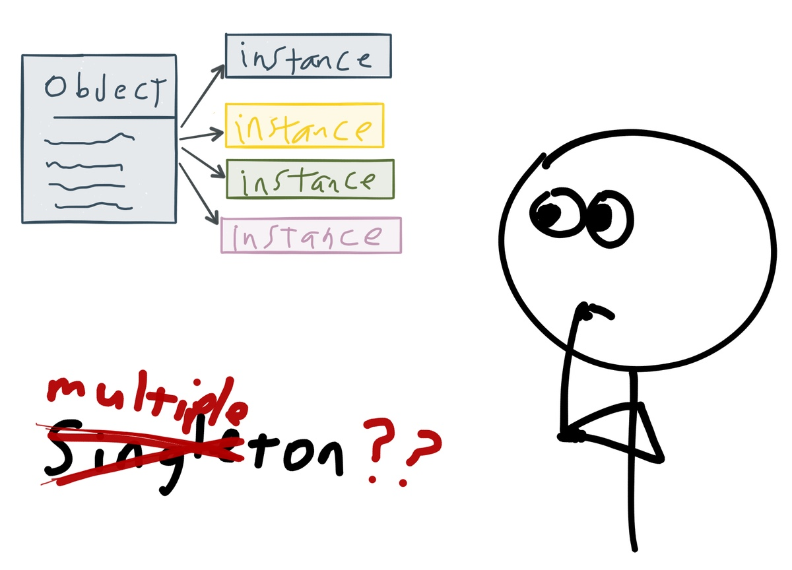

# Singleton



- 소프트웨어 생성 디자인 패턴
- 어떤 클래스의 인스턴스가 <u>**단 한개**</u>만 존재하도록 강제하는 생성 디자인 패턴
- 앱 전체에서 인스턴스는 단 한개만 생성하고, 객체들이 이를 참조하도록 한다 


## 왜 Singleton을 사용하는가

- 메모리 낭비 방지
- 비싼 작업을 한 번만 할 수 있음 
- 인스턴스를 여러개 생성함을 통해 발생하는 혼란을 방지한다
- Singleton은 주로 어디에서든 접근할 수 있는 전역 변수로 선언되기 때문에, 다른 객체들이 singleton 인스턴스를 참고하기 쉬워진다 (DBCP등에서 유용)
- Facade Object에서 사용 


## Singleton in iOS / Swift

- 인스턴스가 단 하나만 만들어지도록 확실히 구조를 정의해야 함 (외부에서 생성이 불가능하도록)

- Swift에서 **전역 변수**와 **전역 상수**는 언제나 지연 계산됨 (지연 저장 속성과 유사 - lazy)

- 따라서 타입(클래스) 프로퍼티, 그 중에서도 전역 상수를 사용하면 Lazy initialization의 방법으로 Singleton을 만들 수 있음

  ```swift
  class Singleton_Class {
      static let shared_instance = Singleton_Class() // 사용 시점에 단 한번 지연 초기화됨
      private init(){} // This prevents others from using the default '()' initializer 
  } // 프로퍼티 블록 closure로 초기화하는 것도 가능
  ```

  - private init()으로 인스턴스의 생성을 원천적으로 봉쇄하고, 오직 전역 타입 프로퍼티인 shared_instance를 통해서만 Singleton_Class의 인스턴스를 활용할 수 있음. 
  - Swift에서는 지연 초기화되는 전역 변수에 대해서는 초기화가 단 한번만 일어날 것을 보장하고 있음
  - 따라서 기존 Objective-C에서 해야 했던 dispatch_once와 같은 부가적인 처리를 더이상 해 줄 필요가 없다


#### Swift에서 Singleton Design Pattern이 활용되는 대표적인 분야는 다음과 같다

 UserDefault.standard

> 앱이 실행되는 시점에 생성되는 기본 저장소에 접근하는 객체(<app id>.plist). 앱이 실행되는 동안(Runtime) 기본 저장소에 접근하여 데이터를 가져오고 기록하는 역할을 함. 

FileManager.default

> 유저의 아이폰 하드드라이브에 저장된 파일들에 접근할 때 사용하는 단 하나의 객체

UIScreen.main

> 유저의 아이폰 스크린을 의미하는 단 하나의 객체

UIApplication.shared

> 앱의 유저 이벤트에 대응하는 라우팅을 담당 (*Q. What is routing?*)

NotificationCenter.default

> 객체간의 소통. Model -> Controller로의 신호. Observer Pattern (후에 공부할 주제) 

NSDateFormatter

> 날짜 포매터를 생산하는 것은 비싼 작업이므로 하나의 인스턴스를 싱글톤으로 캐시에 보장하고 사용할 것을 권장


## 동시성(Concurrency) 문제

- 앱 전체가 하나의 자원이나 객체를 공유하여 사용할 경우, 예상하기 힘든 문제가 생길 수 있음
- 멀티 쓰레드 환경에서 Thread-Safety가 보장되지 않을 수 있다
- 동시성(Concurrency) 문제, 경쟁 조건의 문제 
  1. 초기화 단계 : Swift는 전역 변수 초기화시 atomic한 과정을 보장하기 때문에 이건 문제가 되지 않음
  2. 접근 단계 : 한 쓰레드는 데이터를 읽는데 다른 데이터는 수정을 할 경우.. async Readers-Writers Problem 발생 가능

- **블로킹(Blocking)** 알고리즘으로 해결 가능
  - 먼저 들어온 요청에 우선권을 부여하여 스스로 잠금을 걸고, 데이터 처리 과정이 끝날 때 까지 다음 요청의 접근을 차단함. 요청 내용이 모두 처리되고 나면 잠금을 해제하고 다음 요청을 받음 (Thread-safe)
  - 같은 데이터를 참고하는 Reader와 Writer을 같은 Queue에 올려놓고 Serial하게 작업
  - 전체적으로는 Asynchronous, Concurrent 한 작업이지만, 문제의 소지가 있는 부분만은 Serial, Sync로 처리
  - Cocoa의 UserDefaults 객체는 Thread-Safe하게 설계되어 있음 (***Q. 다른 Cocoa 객체들은?***)


```swift
private var _photos: [photo] = []

// Custom Concurrent Queue
private let concurrentPhotoQueue =
    DispatchQueue(
        label: "xxx"
        attributes: .concurrent)

func addPhoto(_ photo: Photo){
    concurrentPhotoQueue.async(flags: .barrier){ // async Queue
        self._photos.append(photo)
        
        DispatchQueue.main.async{
            self.postContentsAddedNotification()
        }
    }
}

var photos : [photo] { // 읽기 전용 계산 property
    var photosCopy : [photo]!
    concurrentPhotoQueue.sync{ // sync Queue
        photosCopy = self._photos
    }
    return photosCopy
}
```

[예제 코드](https://jdub7138.blog.me/220937372865) 


세마포어, 뮤텍스 등 보다 구체적인 내용은 추후에 Multi-thread 관련 수업에서 배우고 추가할 것


## Reference

https://jdub7138.blog.me/220937372865

http://jeong-pro.tistory.com/86

https://swifter.kr/2016/10/03/swift%EC%97%90%EC%84%9C-%EA%B0%84%EB%8B%A8%ED%95%98%EA%B2%8C-%EC%8B%B1%EA%B8%80%ED%86%A4singleton-%EA%B5%AC%ED%98%84%ED%95%98%EA%B8%B0/

꼼꼼한 재은씨의 스위프트 실전편  

further reading

http://minsone.github.io/mac/ios/swift-properties-summary <- property의 모든 것

http://blog.canapio.com/99 <- 싱글톤 리팩토링