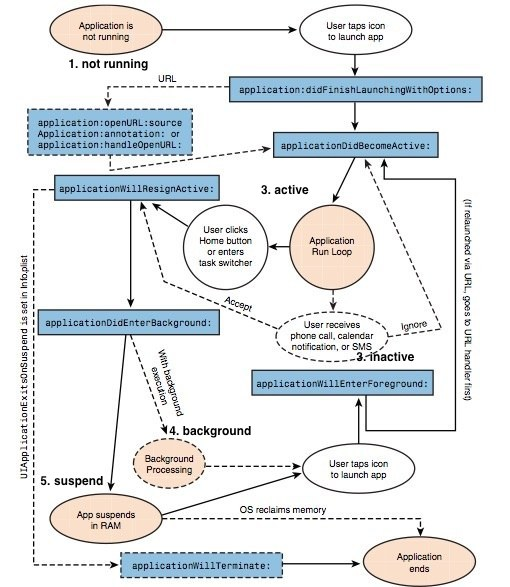

# App LifeCycle(앱 생명주기)

- 앱 생명주기란 어플리케이션의 다양한 상태를 정의한 것

- Swift에서 앱 아이콘을 눌러 앱을 실행시키면 아래와 같은 일들이 일어난다

  1. **UIApplication** 객체를 생성

  2. @UIApplicationMain 어노테이션이 있는 클래스를 찾아 **AppDelegate** 객체를 생성
  3. **Main Event Loop**를 실행(touch, text input등 유저의 액션을 받는 루프) 및 기타 설정. 사용자 입력을 기다림 

 

## UIApplication

- 모든 iOS 어플리케이션은 정확히 하나의 UIApplication 인스턴스를 가지고 있음.

- 어플이 시작될때, 시스템은 **UIApplicationMain(::::)** 함수를 호출하고 이를 통해 Singleton UIApplication 객체가 생성됨

  > iOS는 Obj-C 기반이기 때문에 당연히 main 함수가 있지만, 이는 UIKit에 의해 관리되기 때문에 직접 접근할 수 없음
  >
  > main 함수 내부에서 호출되는 함수인 UIApplicationMain() 에 의해 생성되는 UIApplication 객체는 앱의 시작점이 되는 main 함수에 개발자가 접근할 수 있는 하나의 통로 역할을 함 

  > *Swift는 main( )함수에서 직접 UIApplicationMain()를 호출하지 않고, @uiapplicationmain 어노테이션을 찾아 해당 클래스를 실행한다.* [출처](https://tigerraj.wordpress.com/2016/03/25/where-is-main-file-in-swift/)

- 만들어진 UIApplication 객체는 이후 UIApplication.shared 의 형태로 전역에서 접근 가능

- UIApplication 객체의 가장 중요한 역할은 사용자의 이벤트(터치, 리모트 컨트롤, 가속도계, 자이로스코프 등)에 반응하여 앱의 초기 라우팅(초기 설정)을 하는 것. UIApplication은 이벤트 루프에서 발생하는 이벤트를 감지하고 총괄하여 <u>**App Delegate**</u>에 전달함. 

  >  ex) 앱이 Background에 진입한 상태에서 추가적인 작업을 할 수 있도록 만들어주거나, 푸쉬 알람을 받았을 때 어떤 방식으로 이를 처리할지 등에 대한 것...

  

## The Main Run Loop

- 유저가 일으키는 이벤트들을 처리하는 프로세스를 **Main Run Loop**로 지칭
- UIApplication 객체는 앱이 실행될 때, Main Run Loop를 생성하고, 이 Main Run Loop를 View와 관련된 이벤트나 View의 업데이트에 활용함. 이는 당연히 Main 쓰레드에서 실행됨
- 유저가 일으키는 이벤트의 처리 과정은 다음과 같은 순서로 정리할 수 있음.
  1. 유저가 이벤트를 일으킨다.
  2. 시스템을 통해 이벤트가 생성된다.
  3. UIkit 프레임워크를 통해 생성된 port로 해당 이벤트가 앱으로 전달된다.
  4. 이벤트는 앱 내부적으로 Queue의 형태로 정리되고, Main Run Loop에 하나씩 매핑된다.
  5. UIApplication 객체는 이때 가장 먼저 이벤트를 받는 객체로 어떤 이벤트가 실행되야하는지 총괄하여 결정한다.

  

요약하자면, UIApplication은 다음과 같은 역할을 담당함 (delegate의 역할과 혼재되어 있음)

- 들어오는 터치 이벤트를 지연시킴 ([`beginIgnoringInteractionEvents()`](https://developer.apple.com/documentation/uikit/uiapplication/1623047-beginignoringinteractionevents))

- 외부 알림에 반응([`registerForRemoteNotifications()`](https://developer.apple.com/documentation/uikit/uiapplication/1623078-registerforremotenotifications))

- UI undo-redo를 trigger함 ([`applicationSupportsShakeToEdit`](https://developer.apple.com/documentation/uikit/uiapplication/1623127-applicationsupportsshaketoedit))

- 어플리케이션의 실행 시점을 지연시킴 ([`beginBackgroundTask(expirationHandler:)`](https://developer.apple.com/documentation/uikit/uiapplication/1623031-beginbackgroundtask), [`beginBackgroundTask(withName:expirationHandler:)`](https://developer.apple.com/documentation/uikit/uiapplication/1623051-beginbackgroundtask))

- 지역 알림을 스케쥴링 ([`scheduleLocalNotification(_:)`](https://developer.apple.com/documentation/uikit/uiapplication/1623005-schedulelocalnotification), [`cancelLocalNotification(_:)`](https://developer.apple.com/documentation/uikit/uiapplication/1623082-cancellocalnotification))

  등등… (*근데 사실 UIApplication은 알아서 잘 라우팅 해주고.. 개발자가 건드릴 일도 거의 없을 것 같아 크게 알 필요 없을듯. 결국 처리를 하는 것은 app delegate*)

  

## AppDelegate (UIApplicationDelegate)

- AppDelegate 클래스는 UIApplicationDelegate 프로토콜을 따르며 추가적인 중요한 **<u>런타임 이벤트</u>**를 처리함. 필요할 경우 개발자가 Optional하게 메소드를 만들어서 사용하면 됨. (유용한 것들이 많음)
- UIApplication은 서브클래싱 할 필요도 없고 하기도 어려움. 하지만 그대로 사용하는 것에는 한계가 있기 때문에, UIApplication 객체는 AppDelegate라는 대리 객체를 내세우고 커스텀 코드를 처리할 수 있도록 권한을 부여합니다.
- Xcode는 모든 프로젝트에 대해 생성시 app delegate 클래스 역시 singleton 객체로 자동으로 만들어줌 Appdelegate.swift 파일이 곧 app delegate 객체가 됨
- 클래스 선언부에 붙은 @UIApplicationMain 에 의해, 앱이 구동되면 UIApplication 객체는 AppDelegate.swift의 **AppDelegate** 클래스를 델리게이트 객체로 지정하고 **Main Run Loop에서 발생하는 이벤트를 감지하여 전달함.**
- AppDelegate는 다음과 같은 중요한 작업을 담당함 

  

### 1. 어플리케이션의 시작 시점 관리

- Launch Time에서의 어플리케이션 초기화를 위한 커스텀 코드를 실행하는 작업을 담당함

- 어플리케이션이 실행된 이유(Option)를 Launch Option Dictionary를 통해 파악함

- >  application(_:willFinishLaunchingWithOptions:)_
  >
  >  application(:didFinishLaunchingWithOptions:)

- 기존의 상태(State)를 복원해야 할 필요가 있는지를 판단함
- 어플리케이션이 지원하는 외부 푸시 알림에 가입(register)함
- 열어야 할 URL을 처리함
- 어플리케이션을 위한 윈도우 객체를 제공함

  

### 2. 어플리케이션 상태 변화 관리

- UIApplication이 어플을 관리하는 대부분의 underlying 역할을 한다면, Application Delegate는 여기에 더해 어플의 전체적인 런타임 behavior과 어플의 각각의 '상태'에 접근하는 통로를 제공함. 
- AppDelegate의 메소드는 시스템 라이프사이클 내 중요한 변화 알림(notification)들을 받기 위한 유일한 통로

iOS 어플리케이션은 크게 다섯 가지 상태(Life Cycle)로 구성됨. 

**<u>UIApplicationDelegate는 이 다섯 가지 상태 사이의 변화를 관리하고 감지하는 메소드를 탑재하고 있음</u>**

1. **Not Running**: 아무것도 실행하지 않은 상태

   >  application(_:willFinishLaunchingWithOptions:)
   >
   >  application(_:didFinishLaunchingWithOptions:) - 앱이 처음 시작될 때 실행

2. **InActive**: 앱이 Foreground 상태로 돌아가지만, 이벤트는 받지 않는 상태, 앱의 상태 전환 과정에서 잠깐 머무는 단계

   사용자는 앱을 컨트롤할 수 없음. 외부 노티피케이션, 전화 수신, 알람 등의 상황.  

3. **Active**: 일반적으로 앱이 돌아가는 상태

   > applicationDidBecomeActive(_:) - 앱이 active상태가 되어 실행 중일 때

4. **Background**: 앱이 Suspended(유예 상태) 상태로 진입하기 전 거치는 상태. 어플리케이션이 코드를 진행하고 있지만 화면에 보이지 않는 상황. 경우에 따라 (최소한의)백그라운드 작업을 해야 할 경우도 있음. 

   > applicationDidEnterBackground(_:)  - 앱이 background 상태일 때 실행 

   > applicationWillResignActive(_:) - Called when leaving the foreground state.
   >
   > applicationWillEnterForeground(_:) - Called when transitioning out of the background state.

5. **Suspended**: 앱이 메모리에 있으나, 아무 코드도 실행하지 않는 상태, 시스템이 Background 상태의 앱 중 처리해야 할 일이 없는 앱을 Suspended 상태로 만들고 적절히 not running 상태로 만들어 프로세스를 kill하고 메모리에서 해지함. Suspended에서 Not Running 상태로 넘어갈 때는 알림을 받을 수 없음. 

   > applicationWillTerminate(_:) - Called only when the app is running(background). This method is not called if the app is suspended

* Foreground : InActive + Active 

  

-> [Good Diagram !](https://stackoverflow.com/questions/6519847/what-is-the-life-cycle-of-an-iphone-application)

### 3. 알림(Notification)과 이벤트에 반응

- App delegate는 시스템이 보내는 여러 알림과 이벤트를 담당함

- 이와 같은 알림에 맞춰 사용자는 어플리케이션 레벨에서 특정한 업데이트를 처리해야 함.

  - 백그라운드 다운로드가 필요한 어플이 존재할 경우, 다운로드 시작 시점을 정하기 위해

  - > application(_:performFetchWithCompletionHandler:)

  - URLSession을 통해 백그라운드 다운로드를 하는 어플일 경우, 다운로드 완료 시점을 확인하기 위해

  -  application(_:handleEventsForBackgroundURLSession:completionHandler:)

  - 시스템 메모리가 부족할 때

  - > applicationDidReceiveMemoryWarning(_:) 

    > (The app notifies its view controllers separately so the app delegate should use this notification to remove references to objects and data not managed directly by a view controller)

  - 유저가 아이폰을 잠갔을 때, 권한 없는 접근을 막기 위해.

    >  applicationProtectedDataDidBecomeAvailable(_:)`

   

요약하자면,  UIApplicationDelegate은 다음과 같은 중요한 작업을 담당함

- 어플리케이션의 초기화 코드 작성

- 어플리케이션의 상태 변화 관리
- 메모리 부족, 다운로드 완료 등의 어플리케이션 외부 알림에 반응 
- 실행 시 어플리케이션의 상태를 유지해야 하는지 확인
- 시간의 흐름 감지 (Time-sensitive)
- 어플리케이션의 Centeral Data 객체를 저장하는 데에도 활용될 수 있음

## Reference

https://developer.apple.com/documentation/uikit/uiapplication

https://developer.apple.com/documentation/uikit/uiapplicationdelegate

https://developer.apple.com/documentation/uikit/core_app/managing_your_app_s_life_cycle

https://hcn1519.github.io/articles/2017-09/ios_app_lifeCycle