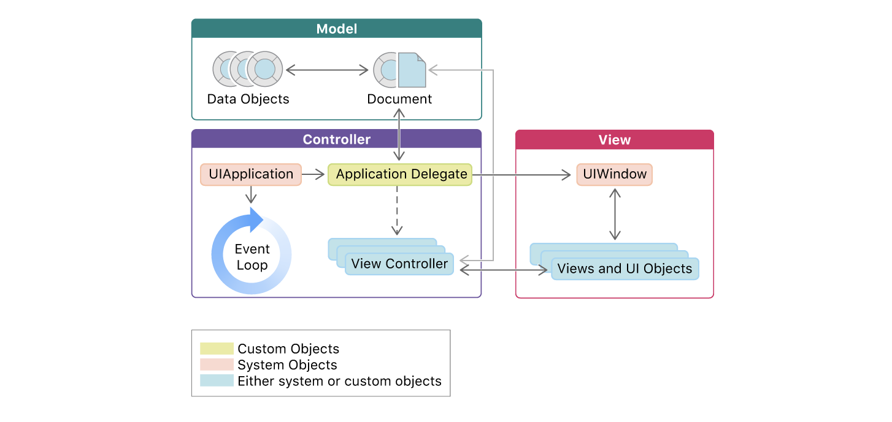

# Basic of UIKit

- Cocoa Touch FrameWork의 핵심을 담당하는 UIKit은 다음과 같은 기능을 담당함

  > User Interface (Window, View Controller, View, Animation)
  >
  > User Interaction (Touch/Presses/Gesture, KeyBoard)
  >
  > Graphic, Drawing, Printing
  >
  > Text (advanced text management in addition to the textview)
  >
  > App Structure (Resource Management, Core App)
  >
  > 이 프레임워크에 속한 객체들은 특징적으로 'UI~' 키워드로 시작 

- 구체적인 분야로 넘어가기 전에, 기본적인 UIKit Programming의 Basis 몇 개만 알아가자

1. Applicaiton이 시작되면 Xcode는 알아서 소스파일을 컴파일해 **App Bundle**을 생성한다.  App Bundle 은 구조화된 디렉토리로,  어플리케이션과 관련된 code와 resources(image assets, storyboard files, strings files, and app metadata)들을 포함한다

   

2. 모든 UIKit Application은 App icon과 LaunchScreen.storyBoard를 반드시 포함해야 한다

   

3. 시스템은 어플리케이션의 configuration과 capabilities에 관한 정보를 앱 번들에 있는 information property list (`Info.plist`) 파일에서 받아온다. 만약 어플이 특정한 **hardware/software requirement**를 요구해야 하는 상황이면 info.plist를 수정해야 함. (꼭 GPS 기능을 사용해야 한다거나, 특정한 시스템 프레임워크를 사용해야 한다거나...)

   

4. UIKit 어플리케이션의 구조는 **[MVC](https://github.com/3zin/Today-I-Learned/blob/master/design_pattern/model_view_controller.md) 디자인 패턴**을 따른다 

   

   

<u>*Very Good Diagram!*</u>

  

**Model** :   어플리케이션의 데이터와 비즈니스 로직을 담당

​	 	개발자는 어플리케이션의 자료 구조를 표현하는 Model Object를 제공해야 한다 (개발자의 영역)

**View** : 	데이터의 시각화를 담당 

​		UIKit Framework은 사전에 만들어진 다양한 View 객체를 제공한다 (Customizing 가능)

**Controller** : 모델과 뷰 객체 사이의 데이터 전달을 담당 

​		어플리케이션의 자료 구조와 UiKit View간의 소통은 View Controller와 App Delegation이 담당한다. 

  

- UIKit과 Foundation 프레임워크는 어플리케이션의 Model 객체를 생성하는 데 도움을 주는 다양한 기본 타입을 제공한다
- UIKit은 UIDocutmet 객체를 통해 disk-based 파일에 대한 데이터 구조를 제공하고, Foundation은 기본 데이터 타입과  객체 타입을 제공한다 
- UIKit 어플리케이션에서 Controller와 View 레이어는 주로 UIKit 프레임워크가 담당하게 된다. (대부분의 screen을 담당하는 UIView 객체, 어플리케이션의 main event loop에서 어플리케이션의 생성 주기를 담당하는 UIApplication 객체)

## Reference

https://developer.apple.com/documentation/uikit/about_app_development_with_uikit