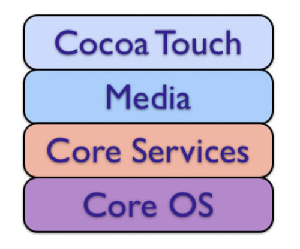

# Cocoa FrameWork

- Apple에서 제공하는 iOS / OS / WatchOS  통합 프레임워크
- UI뿐만이 아니라 하드웨어나 프로그램 일반에 대한 프레임워크도 제공하지만 주로 사용하는 것은 UI쪽
- 프레임워크를 이해하는 것은 곧 애플이 의도한 application의 구조를 이해하는 것 
- iOS의 프레임워크는 기본적으로 다음과 같은 구조로 구성되어 있음

- Cocoa FrameWork(Cocoa Touch FrameWork)는 OS의 가장 상위에서 주로 UI 일반을 담당함
- 크게 Foundation과 UIKit으로 구성됨 

## Foundation

- 프로그램의 중심
- 기본 자료형, 자료구조, OOP 처리와 연산, 메모리 할당 및 관리, 네트워크 통신...
- 모바일 애플리케이션으로서의 특징적 기능에 직접 연관되지 않은 대부분의 공통적인 애플리케이션 기능 처리
- 이 프레임워크에 속한 객체들은 특징적으로 'NS~' 키워드로 시작 (예외 : NSIndexPath -> IndexPath)

## UIKit

- macOS 용인 AppKit를 대신하는 코코아 터치용 프레임워크
- User Interface (Window, View Controller, View, Animation)
- User Interaction (Touch/Presses/Gesture, KeyBoard, )
- Graphic, Drawing, Printing
- Text (advanced text management in addition to the textview)
- App Structure (Resource Management, Core App)
- 이 프레임워크에 속한 객체들은 특징적으로 'UI~' 키워드로 시작 

## Reference

https://developer.apple.com/documentation/

http://pole2win.tistory.com/entry/Objective-C-cocoa-core-foundation

