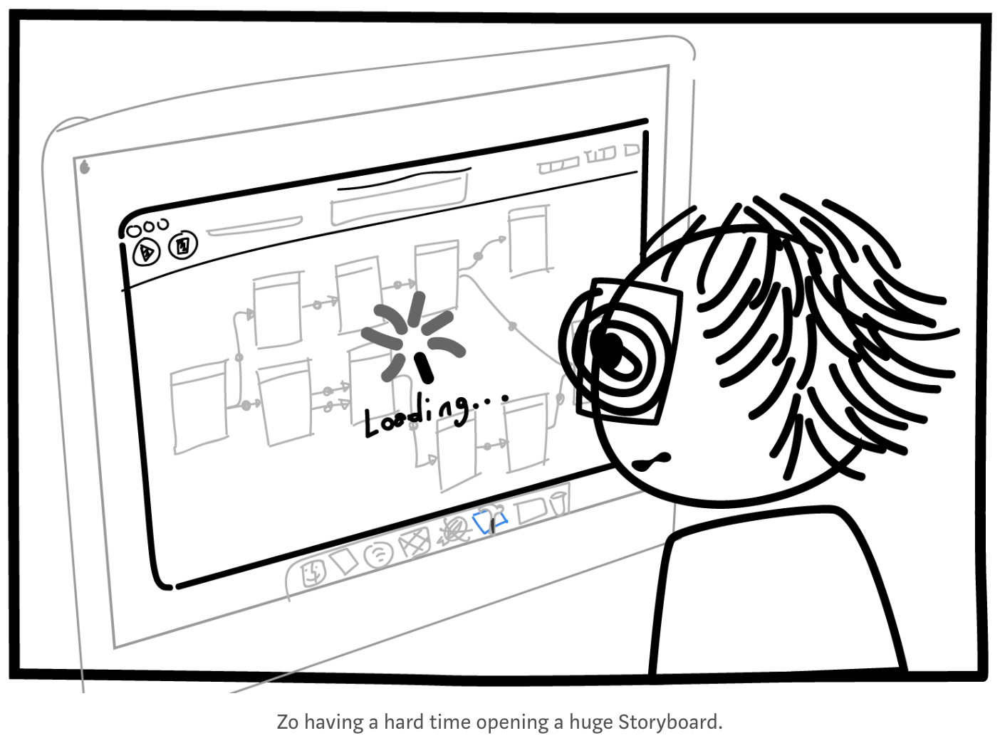

# StoryBoard를 사용하지 않는 iOS 개발



[image from](https://blog.zeplin.io/life-without-interface-builder-adbb009d2068)


### **StoryBoard**

---

-  스토리보드 포맷의 시초는 '인터페이스 빌더'  
- 초기 iOS 인터페이스 구성 파일 확장자는 nib(nextstep interface builder) -> xib(xcode interface builder)
- iOS SDK 5부터 새롭게 도입된 개념 'StoryBoard'
- 스토리보드와 xib의 가장 큰 차이점은, xib와 달리 스토리보드에서는 '실행 흐름' 을 제어할 수 있다는 점
- StoryBoard는 기본적으로 xml 파일이며. 컴파일 시 StoryBoard xml 내부 속성값들이 코드로 넘어가서 class code에 대입되게 됨. 어디까지나 우선순위는 code에 있음. 


## StoryBoard의 장점 

- ViewController 등 다양한 객체에 대한 빠른 초기화(initialization step)

- 직관적이고 명확한 초기 구조 설정 (프로토타이핑에 최적화)

- 시각적인 네비게이션 흐름 (Segue)

- 최초 뷰 컨트롤러만 초기화되고 동적으로 Segue에 따라 객체화되므로 성능도 괜찮음

- 정적 셀

- 오토-레이아웃 

  

## StoryBoard의 단점

- Merge Conflict
- 재사용성
- 뷰컨트롤러 사이의 흐름만 알 뿐, 데이터 흐름을 알 수 없음 (not good for MVC design pattern)
- 뭔가 무슨 일이 일어날지 알 수 없음
- 코드와 StoryBoard 사이의 우선순위가 항상 명확한 것은 아님
- 너무 많은 Optional (Outlet,  **data model properties also become optionals** if you use segue)


## Xib(Nib)

- 스토리보드의 하위호환은 아님

- 하나의 뷰에 초점을 맞춰 스토리보드보다 큰 유연함을 제공하지만, 흐름에 대한 시각적 정보가 없다. 

- 구체적인 UI 구현 가능

- 재사용성이 좋음 (레이아웃 공유 )

- 필요할때 로드하지만 성능이 떨어짐. 

- 모달뷰, 간단한 로그인, 회원가입 뷰, 설정, 팝업윈도우. etc

- 사실 Nib을 거의 써본 적이 없어서 잘 모름

  


## Code

- 결국 Code로 할 수 없는 작업은 없음
- 개발자가 Application의 모든 Control을 쥐게 됨
- Visual 이면의 동작방식을 알 수 있음
- 성능과 재사용성 역시 우월함
- 오토 레이아웃 역시 snapkit같은 API로 해결 가능. 다른것도 마찬가지
- 단점 : 제각각의 리팩토링, 프로토타입 제작이 오래걸림, 어려움  

```swift
let sampleView = UIView()
view.addSubview(sampleView)
sampleView.translatesAutoresizingMaskIntoConstraints = false
sampleView.centerXAnchor.constraintEqualToAnchor(view.centerXAnchor).active = true
sampleView.centerYAnchor.constraintEqualToAnchor(view.centerYAnchor).active = true
sampleView.widthAnchor.constraintEqualToAnchor(view.widthAnchor).active = true
sampleView.heightAnchor.constraintEqualToAnchor(view.heightAnchor).active = true
//... and many more and AppDelegate Window Setting
```


## 그래서? 

- 애플이 스토리보드 사용을 권장하는 것은 사실이지만. 수많은 기업과 스타트업들은 StoryBoard 사용을 꺼리고 있음

- 사실 Code로 짤 줄 알면 StoryBoard로도 할 수 있다. 

- 연습삼아 코드(+Xib)만으로 간단한 어플리케이션을 한 번 만들어보자 

- 하지만, 스토리보드를 쓰면 편한데 안쓰면 그건 그거 나름대로 멍청한 일이다. 

  > ***UI 구성에 세 개의 툴이 있다는건 행운이다***. 
  >
  > Xcode는 같은 프로젝트 내에서 동시에 “효율적”으로 사용할 수있는 이 모든 툴을 제공한다.


## Reference

https://blog.naver.com/codnjs9999/220583427668

http://suho.berlin/engineering/ios/ios-storyboard-nibxib-code/

https://brunch.co.kr/@joonwonlee/5


further reading

http://kka7.tistory.com/84 <- iOS 개발자도 잘 모르는 가장 일반적인 실수 10가지 

http://baked-corn.tistory.com/57?category=729759 <- 스토리보드 없이 CRUD 앱 만들기