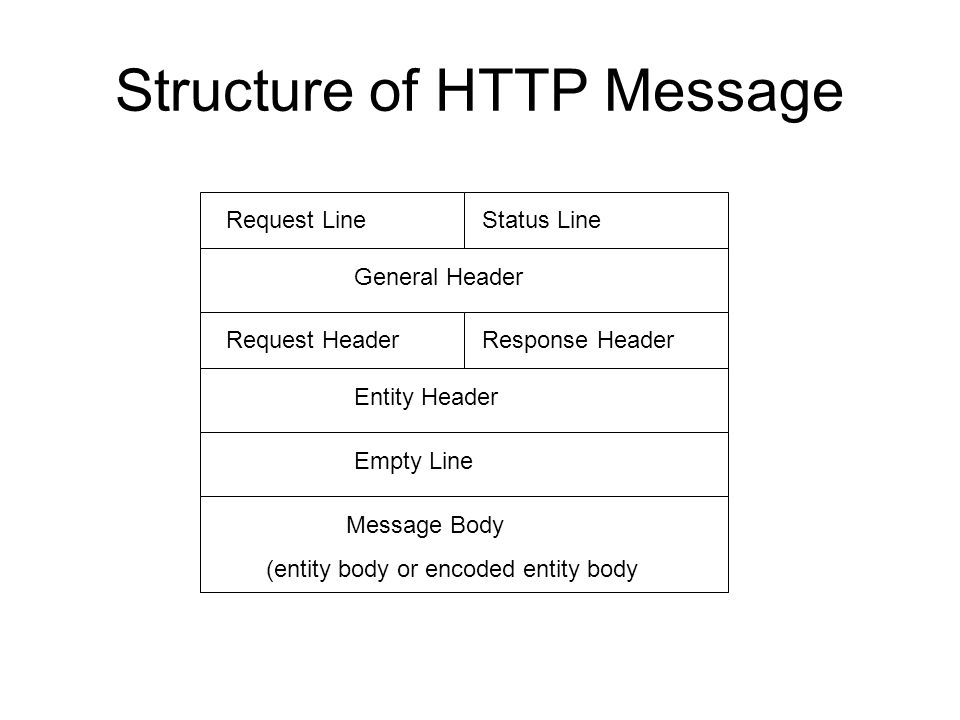

# HTTP


- **H**yper**T**ext **T**ransfer **P**rotocol
- 웹 서버로 보내는 요청의 텍스트 기반 형식
- 클라이언트와 서버 사이의 메시지 교환 규칙
- 대부분의 웹 서버는 응답용  HTTP 메시지에 HTML이나 CSS, Javascript 코드, 이미지 등의 구조화된 데이터를 보내며 브라우저는 데이터를 시각적으로 구조화하여 보여줌

<br>

## HTTP 메시지의 구조

- HTTP 메시지는 요청 메시지와 응답 메시지로 나누어지고, 동일한 구조를 공유함



### 1. Line (라인)

- 메시지의 가장 기본적인 내용인 응답/요청 여부, 메시지 전송 방식, 요청 내용 경로, 버전 정보, 상태 정보 등이 작성되는 부분
- 무조건 한 줄로 작성

### 2. 헤더

- 메시지 본문에 대한 메타 정보가 들어가는 영역
- Key:Value 형식으로 정의. Host 헤더를 통해 어떤 도메인으로 요청이 들어왔는지 구분 
- 길이가 유동적이므로 공백을 기준으로 바디와 구분 

### 3. 바디

- 메시지 본문
- /x-www-form-urlencoded일수도, JSON일수도...

```http
POST /userAccount/login HTTP/1.1
Host: swiftapi.rubypaper.co.kr:2029
Content-Type: application/x-www-form-urlencoded

account=swift%40swift.com&passwd=1234&grant_type=password
```

<br>

## HTTP 메소드의 종류 

HTTP기반 네트워크 아키텍쳐 인터페이스인 REST(Representational State Transfer)에서 규정하는 메소드

대부분의 모바일 통신에는 RESTful 시스템 사용 (RESTful API)

### GET 

- 특정 리소스의 대표적인 정보를 요청할 때
- 클라이언트가 서버에게 URL에 해당하는 자료의 전송을 요청한다.
- 메시지 본문의 파라미터가 라인 URL뒤에 연결되어 전달됨 (쿼리 스트링(Query String))
- 

#### POST

- ID 없이 리소스를 생성하거나 수정할 때
- 클라이언트가 서버에서 처리할 수 있는 자료를 보낸다. 예를 들어, 게시판에 글을 쓸 때 클라이언트의 문서가 서버로 전송되어야 한다.

#### PUT

- ID 기반으로 리소스를 생성하거나 수정할 때
- 클라이언트가 서버에게 지정한 URL 에 지정한 데이터를 저장할 것을 요청한다.

#### DELETE

- 리소스를 삭제할 때
- 클라이언트가 서버에게 지정한 URL 의 정보를 제거할 것을 요청한다.

#### HEAD

- GET 방식의 요청이지만 내용 없이 메타정보만 요청할 때
- GET 요청으로 반환될 데이터 중 헤더 부분에 해당하는 데이터만 요청한다.

#### OPTION

- 특정 URL에 대한 보조 메소드 역할
- 해당 URL 에서 지원하는 요청 메세지의 목록을 요청한다.

<br>

## GET vs POST

### GET

- GET은 URL의 끝에 ? 가 붙고 서버로 요청하고자 하는 파라미터가 이름과 값으로 쌍을 이루어 붙게 됩니다. 파라미터가 여러 개일 경우에는 &로 구분합니다. 

  > www.3zin.com/get_test?name1=value1&name2=value2

- URL에 요청 파라미터를 붙여서 전송.

- URL로 파라미터를 전송하기 때문에 대용량 데이터를 전송하기 힘듦.

- 요청 파라미터를 사용자가 쉽게 눈으로 확인할 수 있음.

- GET은 **정보를 조회하기 위한 메소드**. 
- 정보 조회를 위한 메소드이기 때문에 GET을 사용하여 서버로 요청하여 응답을 받게 되면, 브라우저에서 해당 요청에 대한 응답을 캐시 하므로 사용자의 불필요한 네트워크 이용을 줄여서 빠르게 조회할 수 있음
- URL에 해당 사이트의 구성과 요구하는 Query가 드러나 합쳐져 하나로 전달되기 때문에 보안상의 문제가 존재

<br>

### POST

- POST는 **서버로 데이터를 전송하기 위해 설계된 메소드**
- GET과 달리 파라미터가 URL로 넘어가지 않고 HTTP의 Body에 담아서 파라미터를 전송함. Body에 담아서 서버에게 요청하므로 대용량 데이터를 전송하는데 적합.

- POST로 요청할 때, Request header의 Content-Type에 해당 데이터 타입이 표현되며, 전송하고자 하는 데이터 타입을 적어주어야 함. 
- 데이터가 Body로 전송되기 때문에 GET보다 보안적인 면에서 안전하다고 할 수 있으나, 반드시 암호화하여 전송하여야 함

<br>

### GET과 POST의 차이

GET은 **가져오는 것**, POST는 **수행하는 것**

- GET은 Idempotent, POST는 Non-idempotent하게 설계됨

  > idempotent : 연산을 여러 번 적용하더라도 결과가 달라지지 않는 성질

- GET은 Idempotent하기 때문에 GET으로 **서버에게 여러 번 요청을 하더라도 동일한 응답이 돌아와야 함**
- 반대로 POST는 Non-idempotent하기 때문에 **서버에게 여러 번 요청을 한다면 응답이 항상 동일하다고 볼 수 없음**


GET은 설계원칙에 따라 서버의 데이터(safe method)나 상태를 변경시키지 않아야 하기 때문에 **주로 조회를 할 때에 사용**

>  웹페이지를 열어보거나 게시글을 읽을 때 등 조회를 하는 행위는 주로 GET

- 조회로 사용되어야 하는 또 다른 이유는 웹페이지를 조회할 때, 원하는 페이지로 바로 이동하거나 이동시키기 위해서는 해당 링크 정보가 필요한데 POST의 경우에는 파라미터가 HTTP패킷의 Body에 있기 때문에 링크 정보를 가져올 수 없음

- GET은 URL에 파라미터를 가지고 있기 때문에 링크를 걸 때, URL에 해당 파라미터를 붙여준다면 추가적인 정보를 붙여 더 상세한 링크를 걸 수가 있음

- 모든 걸 담고 있는 URL을 보내줘야 하는 ''공유하기'' 기능에 유용하게 사용됨. 보안상의 문제를 전용. 

  

POST는 **서버의 상태나 데이터를 변경시킬 때 사용**

> 게시글을 쓰면 서버에 게시글이 저장이 되고, 게시글을 삭제하면 해당 데이터가 없어지는 등 
>
>  POST로 요청을 하게 되면 서버/DB의 무언가는 변경되도록 사용

<br>

### [*Google Accelerator 사건*](https://blog.outsider.ne.kr/312)

어떤 웹사이트에 갔을때 페이지에 있는 URL등을 Accelerator가 미리 모두 클릭해봐서 사용자가 해당 URL로 이동하기 전에 이미지등의 미리 받아놓을 수 있는 것들을 받아놓는 역할을 해서 웹서핑의 체감속도를 높여주는 목적

RESTful API의 CRUD개념으로 GET은 read를 호출하는 경우에만 사용되어야 하지만 실제 많은 개발자들은 GET과 POST를 용도구분없이 혼용해서 사용했고 Delete같은 곳에도 GET방식을 편의대로 이용함. Accelerator는 이것을 구분하지 못하니 URL만 보였다 싶으면 냅다 클릭을 해댄 것이고 사용자가 클립한 것이 아닌 Bot이 직접 URL로 접근해버리자 해당 데이터들은 Delete를 수행해버려서 메일이나 게시글이 마구 지워지는 사태가 발생함. 

<br>

## Reference

꼼꼼한 재은씨의 Swift 실전편

https://ko.wikipedia.org/wiki/HTTP

https://slideplayer.com/slide/6187151/

https://hongsii.github.io/2017/08/02/what-is-the-difference-get-and-post/

http://interconnection.tistory.com/72

https://blog.outsider.ne.kr/312