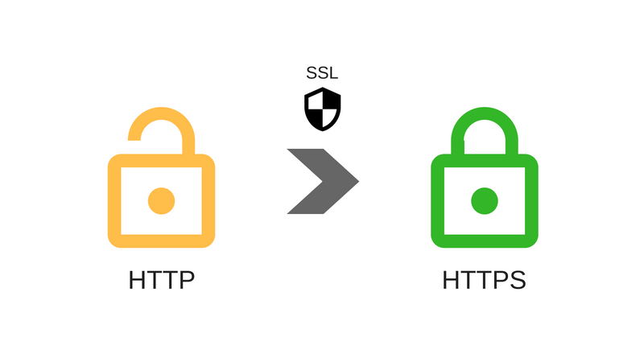

# HTTPS

**HTTP + S(Secure, Socket)**

- HTTP는 메시지를 평문 그대로 전송하기 때문에 패킷을 누군가 훔쳐 보는 스니핑(Sniffing) 공격에 취약
- TLS는 서버와 클라이언트간의 메시지가 인증서를 통해 암호화된 다음에 전송하는 방식
- TLS(SSL) 인증 등 다양한 버전이 존재 (TSL 프로토콜 + HTTP 프로토콜  = HTTPS 프로토콜)
- 발급받은 공개키와 개인키 인증서를 이용해 메시지를 암호화한 다음에 전달
- 애플은 모든 앱에서 HTTPS 프로토콜을 이용한 네트워크 통신만 허용함. ATS(App Transportation Security) 설정을 바꾸어 임시적으로 사용 가능.

 

## TLS(SSL)

TLS : Transport Layer Security

SSL : Secure Socket Layer

**TLS의 3단계 기본 절차:**

1. 지원 가능한 알고리즘 서로 교환
2. 키 교환, 인증
3. [대칭키 암호](https://ko.wikipedia.org/wiki/%EB%8C%80%EC%B9%AD_%ED%82%A4)로 암호화하고 메시지 인증

https://opentutorials.org/course/228/4894

*지금은 보안 관련 자세한 내용은 필요 없을 듯. 메커니즘만 간단히 이해해 놓자. 추후에 완전히 이해하고 본 글에 추가할 것*

 

## Reference

https://opentutorials.org/course/228/4894

https://ko.wikipedia.org/wiki/%EC%A0%84%EC%86%A1_%EA%B3%84%EC%B8%B5_%EB%B3%B4%EC%95%88

https://wayhome25.github.io/cs/2018/03/11/ssl-https/

